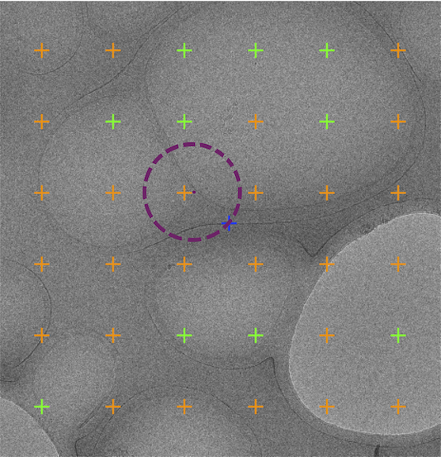
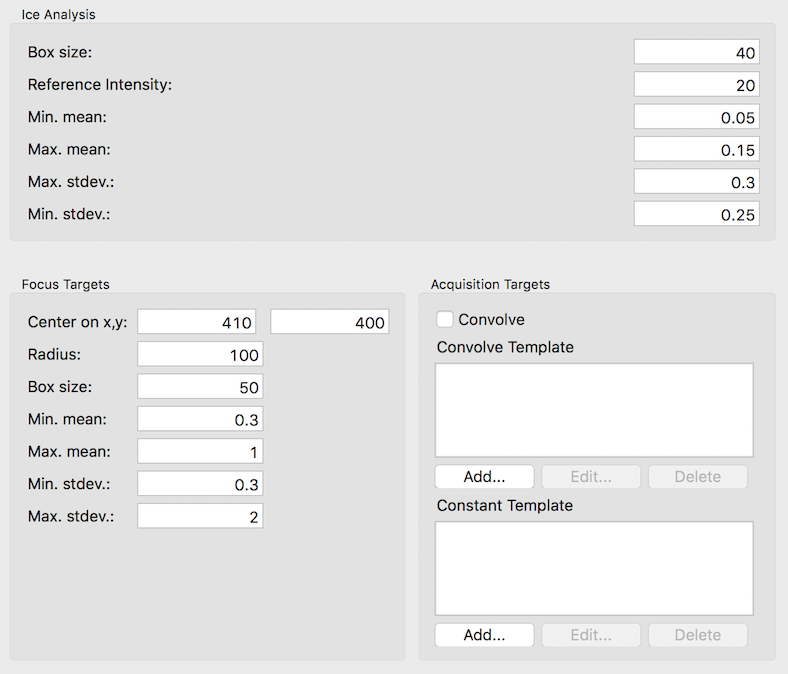

The steps involved are

1. Define raster spacing, angle, and origin.
2. Limiting the imaging area by polygon (typically not to impose limit.
3. Limiting acquisition target by ice thickness
4. Select focus target by statistics

The first three steps are identical to [Raster Finder Node Set up](/leginon/Leginon_Manual/Leginon_MSI-raster_Application/Raster_finder_nodes_set-up), and therefore not described here.

To select the Focus target, the algorithm draws a circle around the center defined in Focus Targets Settings as shown as dashed purple circle. At each point of the circle, it calculates the mean and standard deviation within the box size defined in the settings. Within the range of acceptable ice thickness mean and standard deviation, it selects the position with largest thickness mean as the targeting position.

## Tips for the settings:

The settings below was used to obtain the targets shown in the above screenshot. There are a few rules used in the settings that may help with a good settings.

1.  Focus Target Center is arbitrary but should allow the statistics circle to be in within the image.
2.  The radius of the statistics circle should be chosen that the circle has a good chance to intercept support film even if the center happens to be at the center of a hole.
3.  Box size can be the same as what is used for acquisition target or larger to be more sensitive to the variation.
4.  Choose Min. mean ice thickness at the high threshold of the same setting for acquisition targets to bias the choice toward the support film.
5.  Choose Min. stdev ice thickness at the high threshold of the same setting for acquisition targets to bias the choice toward edge of the support film.

