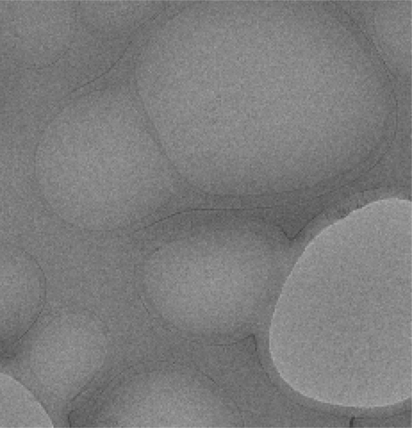
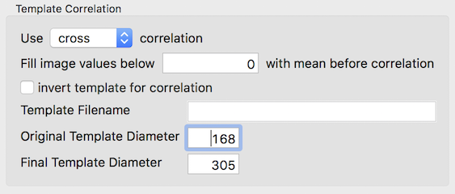
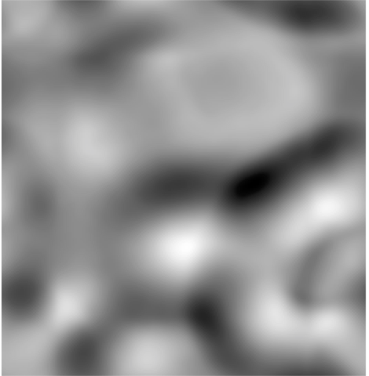
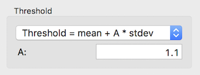
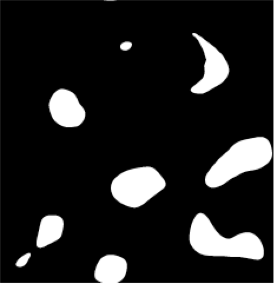
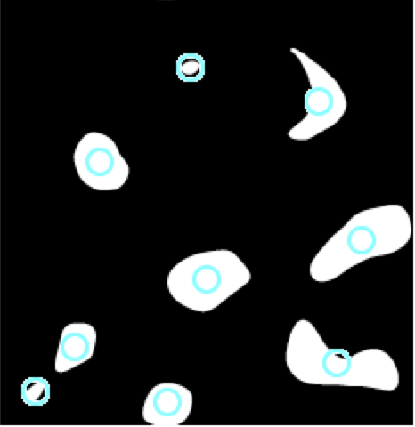
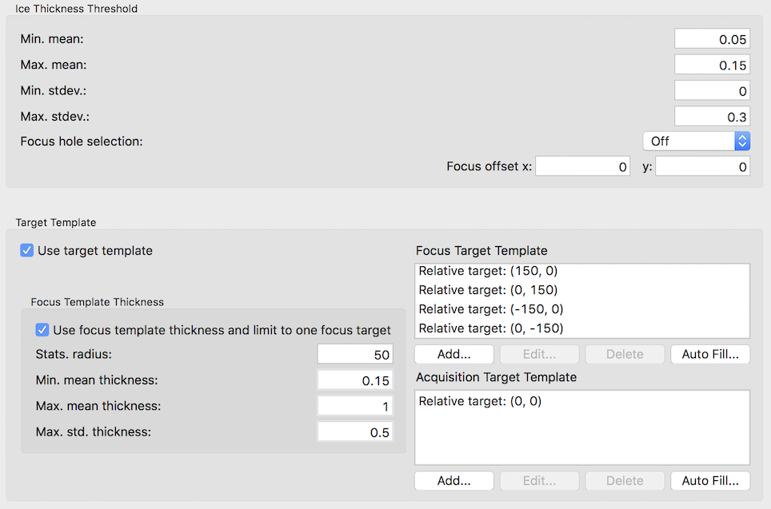
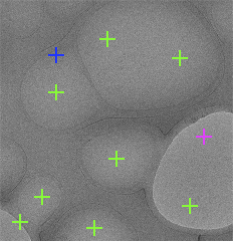

By loosen up criterion of template hole finder used in MSI-T, it can be used as a target finder for Lacey carbon support as shown below used in Exposure Targeting Node.

## Original Image

## Template Correlation

-   Use cross correlation to create a broad correlation peak
-   Use default template and a large value, but smaller than the half width/height of the image to scale the template. This creates a correlation map that is likely to have maximal some distance inside of the hole edge. Hence, for large holes you may see multiple maxima.

## Correlation Threshold

-   Use a small value to threshold the correlation map so that even the weaker peaks from large holes can pass through, but not too low that all blobs are connected.

## Blobs

-   Allow a reasonable number of blobs that you expect it to find to accept most peaks as blobs.
-   Accept very large blobs by using a very large Max. blob size in pixels.

## Lattice

-   Give a very large lattice tolerance such as 0.5 so that it will accept all blobs.

## Targets

-   Set up Acquisition targets as in usual MSI-T to avoid empty holes if possible.
-   Set to convolute targets so that there are many potential Focus position to screen from
-   Set Focus target filtering to prefer thicker ice than the Acquisition targets.

