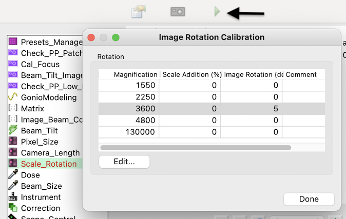
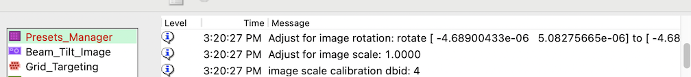

The mapping of pixel position in a low mag image to a pixel position in a high mag image depends on the physical space matrix. Large defocus causes a rotation and scale change in the image that is not
accounted for when we apply shift matrix based on target picked on different magnification.

Manually an extra rotation can be added in Scale Rotation node in Calibrations application on the preset that has a large defocus and involved in the image shift targeting, for example, the magnification of hl preset.

You will have to test your values through trial-and-error. I would

1. acquire hl image in Hole node
2. pick some obvious targets such as the center of latex beads on several positions, including one at the center.
3. submit the targets and let en preset acquire these target images, and then compare the results with each adjusted values.

The default is 0 % increase in scale and 0 degrees in rotation.

Here is what the interface looks like after you click on the "play" button indicated by the arrow.

When this is being applied, you will see it in PresetsManager Logger Panel like this:

