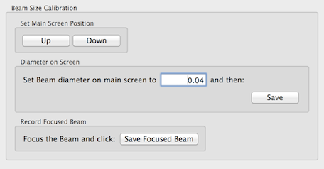

Beam size of FEI microscope can be approximate with a linear function. This calibration determines the coefficient of this linear equation with two points, one where the beam is at cross-over and one at a known size on the main viewing screen (or FluCam on Krios).

## Procedure

1.  Select the preset beam size is to be calibrated in "Presets Manager" node and send it to the scope. Most likely this is "en" preset used in the final exposure.
2.  Left click on  in the toolbar to start calibration.
3.  If C2 aperture size is not specified at the start of the session, the dialog will ask for the value at this point.
4.  Put the main screen of the scope down and expand the beam to a known size. The 4 cm diameter circle on FEI scope is a good reference.
5.  Enter the size of the beam at this known size in the settings and then click on "Save" in the settings dialog
6.  Contract the beam to the cross-over and click on "Save Focused Beam" in the settings dialog.
7.  Click "OK" to exit the dialog and save the calibration

