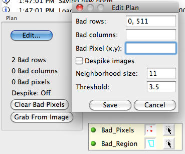
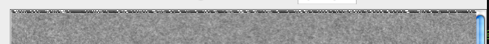
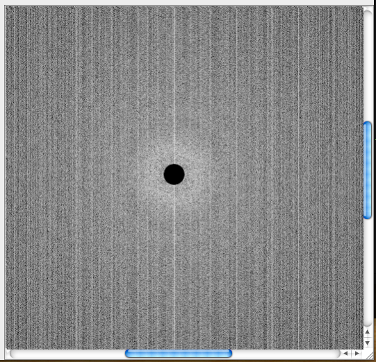

## Note: FEI Falcon and Ceta camera can not use references acquired through Leginon. See [Falcon gain correction](/leginon/Leginon_Manual/Complete_Installation/Installation_on_the_instrument_computers/Installation_on_the_camera_computer/Falcon_camera_support/Falcon_gain_correction) and [Ceta camera support](/leginon/Leginon_Manual/Complete_Installation/Installation_on_the_instrument_computers/Installation_on_the_camera_computer/Ceta_camera_support), respectively.

Bright and Dark reference images need to be acquired for every camera setting that will
be used. The camera settings include image dimension, bin size, and offset. Over time,
references may need to be repeatedly acquired.

## Where are the reference images?

reference images are now saved automatically to special sessions name containing "_ref" in the same base leginon directory defined in leginon.cfg as image_path. Every 90 days, a new session is automatically created so that the very old ones can be archived away eventually. Also, if a linux user has no write permission to the existing reference session, a new one will be created so that there is no delay in data collection. All users still need read-access to these directories in order to use them.

For example, on Jun 1st, 2012, a user starts the first time a Leginon session. His/her leginon.cfg has these lines:

[Images]
path: /your_disk/leginon

Therefore, Leginon creates a reference session with this path

/your_disk/leginon/12jun01_ref_a

## Correction Channels

When two flat-field-corrected images are correlated, there is often an origin peak
derived from the common normalization image even if both image acquisition contains only
noise. In order to avoid this problem, two or more sets of bright/dark references, and hence
normalization images can be obtained per camera configuration. When a correlation
between two images are done, Leginon will check the channel of the correction the first
acquired image has used and then force the new image to be corrected by a different
channel.

We recommend that you always acquire reference images on both channels.

## Acquire reference images

1.  scope> make sure that the digital camera will be acquiring images in an area with uniform
    beam intensity such as an empty area with no specimen nor support. You may skip a trip
    to the scope room by sending one of the high mag preset to the scope from
    Leginon.
     
2.  Leginon/Node Selector> Select "Correction" node.
     
3.  Leginon/Correction/Toolbar> Open "Settings" window.
     
4.  Leginon/Correction/Toolbar/Settings> Select one of the Common Camera
    Configuration or select Custom mode and enter your own values based on the presets you
    created.
     
5.  Leginon/Correction/Settings/Camera Configuration> Enter the Exposure time. It
    should be chosen so that the image is not saturated and ideally close to the condition
    that will be used in the experiments. If unsure about the experimental condition, use an
    exposure time that gives high but not saturated counts.
     
6.  Leginon/Correction/Settings>By default, the corrector node is set to average 3
    images together to create one reference image and to despike the hot pixels with
    averaged neighbor hood values. These can be changed if desired.
     
7.  Leginon/Correction/Settings> Click OK to exit settings.
     
8.  Leginon/Correction/Toolbar> Select "Channel 0" in the channel number
    selector so that the next step will acquire only one image.
     
9.  Leginon/Correction/Toolbar> Select "Raw image " from the pull down list of
    acquisition modes and then click on "Acquire" button next to the selector to view an
    image that is not corrected.
     
10. Leginon/Correction/Toolbar> Select "Both Channels" in the channel number
    selector so that the next steps will acquire images for both correction channels.
     
11. Leginon/Correction/Toolbar> Select "Dark reference" in the acquisition mode
    selector and then click "Acquire" to acquire the Dark reference image for this
    particular camera configuration.
     
12. Leginon/Correction/Toolbar> Select "Bright reference" and repeat the acquisition
    to obtain the Bright reference.
     
13. Leginon/Correction/Toolbar> Select "Channel 0" in the channel number
    selector so that the next step will acquire only one image.
     
14. Leginon/Correction/Toolbar> Select "Corrected image" and then "Acquire" to view
    the corrected image. A corrected image should be free of artifacts and have smaller
    standard deviation than the raw image, in general.
     
15. Repeat steps 3-14 for all the images and bin sizes that will be used:
     
16. If [a pixel, a column/row](/leginon/Leginon_Manual/Leginon_Calibrations_Application/Bright_and_Dark_reference_images#Correction-Plan) or a [region](/leginon/Leginon_Manual/Leginon_Calibrations_Application/Bright_and_Dark_reference_images#Bad-Region-Correction) gives bad values in the bright or dark image
    after a few trials, it may be excluded in all corrected images.
     
    **Bright/Dark Reference Image Need for the Example MSI with 4kx4k camera:**

  ----------------------------- --------- ----------------------------------- -----------
  **Dimension after binning**   **Bin**   **number of correction channels**   **Notes**
  4096                          1         1 or 2 if used for tomo preset      
  1024                          4         2                                   *[]{.1}*
  1024(centered)                1         1                                   *[]{.2}*
  512                           8         2                                   *[]{.3}*
  512 (centered)                1         1                                   *[]{.3}*
  ----------------------------- --------- ----------------------------------- -----------

*[]{.1}*-This camera configuration is used in preset beam shift alignment even if you don't use it for a preset.
*[]{.2}*-This camera configuration is used in Manual Application Manual Focusing even if you don't use it for a preset.
*[]{.3}*-These camera configurations are used in preset image shift alignment even if you don't use it for a preset.

## Image Despike

The Despike feature removes random bright or hot pixels from the acquired images. This
hot pixel is assigned the average intensity of the surrounding area, a circle of the radius
which is entered in Neighborhood Size. The Despike Threshold is the number of standard
deviations away from the mean that qualifies a pixel for despike correction. The despike
affects the flat-field corrected image saved on the disk and can not be recovered.
Therefore, use a minimal neighborhood size to avoid artifact and set the threshold high to
avoid over-despiking.

Activation of this feature and its parameter settings are defined when in the pop-up dialog for "Edit Correction Plan". See below.

## Correction Plan

Bad Pixel, Rows and Bad Cols are used to ignore portions of the image that do not read well off of the digital camera. The values entered into here are determined empirically for each instrument and camera configuration that Leginon operates on. If one column or row of the images is incorrect, it may look like this when displayed:

and like this in power spectrum display

Measure the location of the row and column that need to be removed from this image. These values should then be entered as a sequence of values separated by commas by editing the
Plan. Click Save after adjusting.

Individual bad pixel can also be corrected by its surrounding pixels. Choose these
pixels with the selection tool on the image and then click on "Grab From Image".

## Find A Single Bad Pixel

When a single pixel is defected, it may not be easy to find it on a large image, even if
it changes the stats dramatically. A tool is available to help finding these pixels:

1.  Leginon/Correction> Acquire either a corrected image that shows the bad
    stats.
     
2.  Leginon/Correction/Toolbar> Left-click on the 
    button to "Add extreme points to bad pixel list". There
     
3.  Leginon/Correction/Tools> Left-click on the "Add Region" tool that looks like
    "+". This adds the selected bad region to the bad pixel plan.
     
4.  Leginon/Corrections> Acquire a corrected image in the same configuration to
    check if the apearance improves.

## Bad Region Correction

Note: Bad region correction are corrected pixel-by-pixel. This can be **computational intensive** if a large region is included. If flat-field correction alone gives reasonable result, you should minimize usage of the this function.

When a large region is covered by a fallen chip, image correction through bright/dark reference may not be sufficient to produce a spike-free image since the bright and dark values in the region are almost identical. To add such a large region into bad pixel plan, do the following:

1.  Leginon/Correction> Acquire either a bright or corrected image that shows the
    bad region clearly.
     
2.  Leginon/Correction> Use "Regions" target tool next to the image to enclose the
    bad region. The corners that the target tool identifies can be larger than the bad
    region but should be close to its size so that not too much is corrected.
     
3.  Leginon/Correction/Tools> Left-click on the "Add Region" tool that looks like
    "+". This adds the selected bad region to the bad pixel plan.
     
4.  Leginon/Corrections> Acquire a corrected image in the same configuration to
    check if the appearance improves.

[< Pixel Size Calibration](/leginon/Leginon_Manual/Leginon_Calibrations_Application/Pixel_Size_Calibration) | [FEI scopes: Image Shift matrix calibration >](/leginon/Leginon_Manual/Leginon_Calibrations_Application/Image_Shift_matrix_calibration)
[< Pixel Size Calibration](/leginon/Leginon_Manual/Leginon_Calibrations_Application/Pixel_Size_Calibration) | [JEOL scopes: Image shift matrix calibration and jeol.cfg refinement >](/leginon/Leginon_Manual/Leginon_Calibrations_Application/Bright_and_Dark_reference_images/Using_image_shift_matrix_calibration_to_refine_image_shift_scale_in_jeolcfg)
