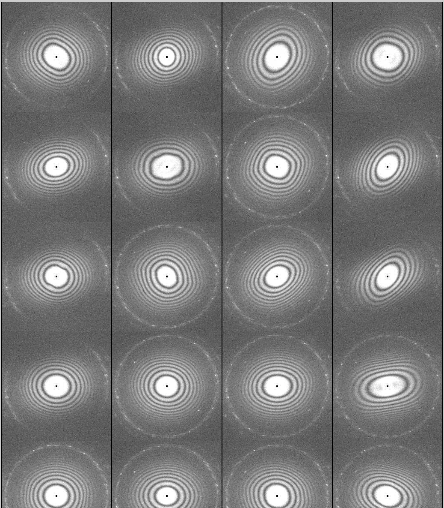

The patch test images taken in "Check PP Patches" node can be viewed from image viewers. But it is convenient to stitch the power spectra together according to its geometric relationship. This pptestStacker.py Appion Script will do that.

You need to know the session name session id, project id until I make an myamiweb gui. These can be obtained from inspecting other Appion Script ran in the same session.

The syntax of the script is

    pptestStack.py --session=16oct18c -p 43 --runname=pp1 --rundir=/mydata/appion/my_directory/16oct18c/pp1 --jobtype=pptest --no-commit --expid=2776

The script will use the aligned images if available.

The output is an mrc image stack. Each row of the plate patches is one frame in the stack.

A partial result is shown here

