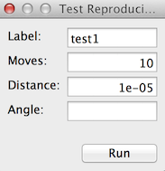

The Navigation node is quite useful because it allows the user to test many of the
calibrations that have been completed, such as image shift, beam shift, stage position,
modeled stage position, and dose measurements (indirectly). Additionally, Navigator could be
used to simply navigate across the grid in the microscope using Leginon calibrations.

## Navigate using a calibration

A particular calibration, "stage position, image shift, modeled stage position, or beam
shift," can be chosen to navigate bases on the current image in Navigator. For example,
clicking on the center of a beam offset to the side in the acquired digital camera image with The "beam
shift" move type will center the beam around the point where the mouse was clicked.

1.  Leginon/Navigation/Toolbar/Settings> select the TEM Parameter for navigation (the calibration to test)
     
    Available calibrations (these calibrations are only available if they have been completed):
     
    -   [Stage Position](/leginon/Leginon_Manual/Leginon_Calibrations_Application/Stage_Position_matrix_calibration)
         
    -   [Image Shift](/leginon/Leginon_Manual/Leginon_Calibrations_Application/Image_Shift_matrix_calibration)
         
    -   [Modeled Stage Position](/leginon/Leginon_Manual/Leginon_Calibrations_Application/Modeled_Stage_Position_calibration)
         
    -   [Beam Shift](/leginon/Leginon_Manual/Leginon_Calibrations_Application/Beam_Shift_matrix_calibration)
         
    -   Image Beam Shift (Using Image Shift and Beam Shift calibration to perform
        shift of one without affecting the other. This move type is used only on scopes
        that do not internally make such adjustment such as JEOL scopes)
         
2.  Leginon/Navigation/Toolbar> Click Acquire .
     
3.  Leginon/Navigation> Activate the click tool just above the image panel .
     
4.  Leginon/Navigation> Target a feature on the image with a single left click
     
    - The feature that is clicked will be centered in the image. If the feature is
    not centered in the new image, then the calibration needs to be repeated or the
    microscope has been altered in some way.

## Iterative Move Navigation

Navigation, especially navigation by stage position movement, has error that is larger
at larger moving distance. Therefore, the accuracy of the navigation by stage movement can
be improved by multiple moves. By specifying the tolerance of the navigation error, Leginon
can achieve more accurate navigation. This feature is activated by giving a non-zero value
for "Move to within xx m of clicked position" within Navigator for direct click-and-move or
from an Acquisition node class that uses Navigator as the mover.

When Acquisition node class uses Navigator as the mover, you may want to check the
"Preset cycle after each move" option reduce hysteresis. The downside of this is that it can
take a lot of time.

## Calibration Assessment

Calibration Error Checking is on by default in settings. It calculates and displays how
much error there is between the targets that were selected and how accurate the selected
calibration moved to that target. When calibrated properly, the image shift error should
always be better than 1 % of the image dimension, beam shift 5 %, modeled stage position
< 1.5 um, and stage position < 5 um On our FEI Tecnai microscopes.

## Stage Locations

Save (x, y) stage positions in the Stage Locations section to revisit the same positions later.
Keep the From Scope gets X and Y Only check box enabled is a general practice.

*Save a new location:*

1.  Leginon/nav/Navigator> enter a New Name (for the postion that will be saved).
     
2.  Leginon/nav/Navigator> enter a New Comment.
     
3.  Leginon/nav/Navigator> click New Location From Scope (to save the current stage position).
     
    - The new saved location will appear in the Location Selector.

*Go to a saved location:*

1.  Leginon/nav/Navigator> select a location (from the Location Selector).
     
2.  Leginon/nav/Navigator> click To Scope

*Update / Remove a saved location:*

1.  Leginon/nav/Navigator> select a location (from the Location Selector).
     
2.  Leginon/nav/Navigator> click From Scope (to update) or Remove (to delete the location).

## Stage Movement Test

This tool in "Navigation" node (icon looks like a ruler) repeatly attempt to reach the current stage position by sending its coordinates to scope from a defined remote location.
It displays the offset it arrive at in the logger window.

The dialog looks like this:

- **Label**: This is used to identify the test run in the database within the session. There is no file output for this test.

- **Moves**: Number of test repeats

- **Distance**: Radius to move away and back in meters
- **Angle**: If left blank, the remote location will be at a random direction, different each time. If specified, the angle will be fixed.

**Note** The move requires no Leginon calibration but the physical distance shown in the offset log would be affected by the pixel size calibration.

## Other features

-   The [Camera Configuration](/leginon/Leginon_Manual/Node_Descriptions/Presets_Manager#Parameters-Instruments) is the same as in Presets Manager.

[< Scaling Stage Position Matrix](/leginon/Leginon_Manual/Leginon_Calibrations_Application/Stage_Position_matrix_calibration/Scaling_Stage_Position_Matrix) | [Autofocus Calibration with Beam Tilt Node >](/leginon/Leginon_Manual/Leginon_Calibrations_Application/Autofocus_Calibration_with_Beam_Tilt_Node)
