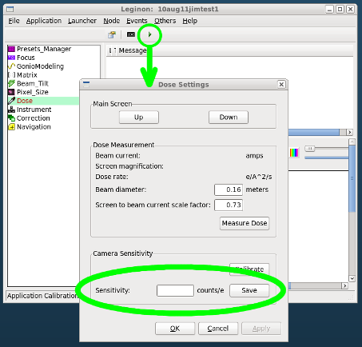

Dose Calibration is a calibration of digital camera sensitivity. This calibration is required only once at each high tension per instrument.

Camera sensitivity is counts on camera per electron input.

You can either enter the pre-determined camera sensitivity value provided by camera supplier under similar condition you use for data collection or, if available to you, use Faraday cup or screen current to measure electron input and use camera to get average counts on the camera with the same beam.

## Enter pre-determined camera sensitivity value

-   Instruction for [Gatan K2 Summit camera](/leginon/Leginon_Manual/Complete_Installation/Installation_on_the_instrument_computers/Installation_on_the_camera_computer/Gatan_K2_Summit_Support/Using_Gatan_K2_Summit_in_Leginon/K2_camera_sensitivity)
-   For K3, follows K2 super-resolution instruction.

1.  Leginon/Dose/Calibrate/Camera Sensitivity> Enter Sensitivity values in counts per electron.
     
2.  Leginon/Dose/Calibrate/Camera Sensitivity> Click on Save.

[Faraday Cup Measurment Notes](/leginon/Faraday_Cup_Measurment_Notes)

## Determine the screen current/beam current scale factor

The following uses a Faraday cup

1.  Scope> Move the stage to an empty area or a broken hole.
     
2.  Scope> Adjust the beam so that it passes through the measuring area of the Faraday cup.
     
3.  Scope> Choose a magnification so that the same beam will pass within but almost to the main screen, too.
     
4.  Leginon/Dose/Dose Calibrator> Beam Diameter = 0.16 m for Tecnai main screen.
     
5.  Leginon/Dose/Dose Calibrator> Enter Screen Current to Beam Current Scale Factor as 1 as a starting point.
     
6.  scope> Optionally lower the screen. Dose Calibrator will automatically do this if the user forgets.
     
7.  Leginon/Dose/Dose Calibrator> Click Measure Dose Rate. The Dose Rate, Beam Current, and Screen Magnification will appear in the corresponding fields after they have been calculated.
     
8.  Leginon/Dose/Dose Calibrator> Adjust the Screen Current to Beam Current Scale Factor so that the displayed beam current is equal to that of the Faraday cup measurement. NRAMM Tecnai's value is 0.88. We don't have values for other microscopes since we no longer own a Faradat cup for such calibration.

## Calibrate the camera sensitivity

1.  Scope> Move the stage to an empty area or a broken hole.
     
2.  Scope> Expand the beam so that it covers the main screen and illuminate it uniformly.
     
3.  Leginon/Dose/Settings> Configure camera with override preset activated.
     
4.  Leginon/Dose/Dose Calibrator>
     
    -   Beam Diameter = 0.16 m for the Tecnai's main viewing screen.
         
    -   Screen Current to Beam Current Scale Factor = (as determined above or 1 to assume good calibration by the microscope manufacturer)
         
5.  scope> Optionally lower the screen. Dose Calibrator will automatically do this if the user forgets.
     
6.  Leginon/Dose/Dose Calibrator> Click Measure Dose Rate. The Dose Rate, Beam Current, and Screen Magnification will appear in the corresponding fields after they have been calculated.
     
7.  Leginon/Dose/Dose Calibrator> Without changing the beam intensity, click on "Calibrate". An image is acquired by Leginon.
     
    *Leginon will automatically lift the main viewing screen on the microscope. Some users report that the function does not work on their microscopes. Do it manually if the automatic function does not work.
     
8.  The calculated camera sensitivity (counts / electron) will display once the calculation is completed.

**Dose Calibration Need for the Example MSI:**

  Preset   magnification
  -------- ---------------
  *       any

[< Autofocus Calibration with Beam Tilt Node](/leginon/Leginon_Manual/Leginon_Calibrations_Application/Autofocus_Calibration_with_Beam_Tilt_Node)
