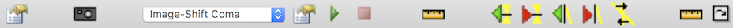
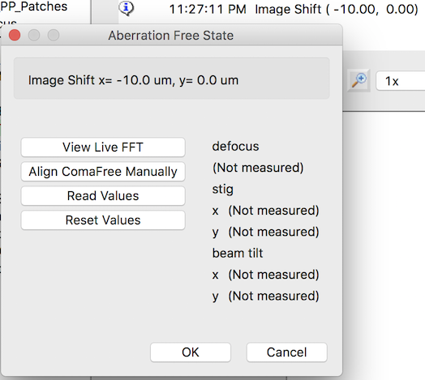
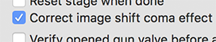
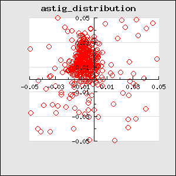

Beam-Image Shift (or called Image Shift in most Leginion documentation) causes changes in a number of lens aberration values. The image can be restored to non-shifted values by applying correction values in beam tilt, objective stigamator, and defocus. Each of them linearly dependent on the amount of the shift.

The calibration in Beam Tilt Node iterate through specified number of steps and interval to apply beam-image shift in x and then y direction of the deflector coil and then allow the user to find the beam tilt, stigmator, and defocus adjustment that will bring the original coma-free and ctf value back. Each of these corrections are stored and fitted to obtain the slope and form the calibration matrix.

Among the three corrections, defocus is the least stable but also least critical for getting good result for data collection, and the next is defocus astigmatism. These two can be estimated post-data collection and corrected with typical ctf correction software.

Currently, because the auto-coma correction algorithm in Leginon is still slow to converge, I recommend use external programs to do the correction at each step. If you don't have AutoCTF, you can do the coma-free alignment and stig correction manually with the tools provided in this node. It just takes longer and you need to know what you are doing.

Once it is calibrated once, the next time it will start the aberration correction from the last calibration, making it easier to refine. Therefore, we recommend calibrate the first time with 1 step image shift in each direction (total of 6 image shifts (twice at (0,0)) that you need to make coma and stig free). Once it is done, do it at 2 steps so that you get a total of 5 points on each axis to improve the result.

## [Using TFS AutoCTF to calibrate beam-image shift aberration correction](/leginon/Leginon_Manual/Leginon_Calibrations_Application/Lens_Aberration_Correction_Calibration_for_Beam-Image_Shift_Targeting/Using_TFS_AutoCTF_to_calibrate_beam-image_shift_aberration_correction)

## [Using Leginon manual tools to calibrate beam-image shift aberration correction](/leginon/Leginon_Manual/Leginon_Calibrations_Application/Lens_Aberration_Correction_Calibration_for_Beam-Image_Shift_Targeting/Using_Leginon_manual_tools_to_calibrate_beam-image_shift_aberration_correction)

## Preparation

1.  Use thin carbon, cross-grating or any other standard specimen that gives good Thon ring.
2.  Position the grid so that 10 um image shift will still in the same square if possible.
3.  Align the scope well with the grid at eucentric height and 0,0 image shift at the magnification range that will be used for data acquisition.
4.  Take out energy filter slit if the camera is behind GIF.
5.  Do coma-free alignment and correct astigmatism with autoCtf or with "BeamTilt Image" node and ManualFocus tool in "Cal Focus" node.
6.  Set the defocus to a value that is easy to make measurement
    #* AutoCTF: for example --2.5 um at 1.5 Å/unbinned pixel or --1.5 um at 1.05 Å/unbinned pixel. I use 8 mrad beamtilt for the latter settings instead of 10 mrad.
    #* Manual method within Leginon: --0.7 um at 1.05 Å/unbinned pixel works well. Write down the radius of the Thon ring node or take a screen shot. This will help setting the value at each image-shift.

## Set up Leginon for calibration

1.  Calibrations/Presets Manager> Make a preset of the prepared exposure that is good for AutoCTF.
2.  Calibrations/Presets Manager> Send the preset to scope.
3.  Calibrations/Beam Tilt/Toolbar> Select calibration type: Image-Shift Coma
4.  Calibrations/Beam Tilt/Toolbar> Left click on "Parameter Settings" to the right of the calibration type selection to open the settings
5.  Calibrations/Beam Tilt/Parameter Settings> Set these recommended values to shift in x 10,5,0,--5,--10 um without shift in y and then shift in y in the same sequence without shifting x.
    1.  Measure coma at 2 positions per image shift direction
    2.  Add additional 5e-6 m image shift at each position
6.  Calibrations/Beam Tilt/Parameter Settings> click OK to accept the values and exit the dialog.

## Calibrate

### **IMPORTANT: Do not reset defocus during the calibration**

1.  Calibrations/Beam Tilt/Toolbar> Left click the green "Play" button to start calibration. Leginon will save the current scope state as the escape values.
2.  Use either [AutoCTF](/leginon/Leginon_Manual/Leginon_Calibrations_Application/Lens_Aberration_Correction_Calibration_for_Beam-Image_Shift_Targeting/Using_TFS_AutoCTF_to_calibrate_beam-image_shift_aberration_correction) or [Manual](/leginon/Leginon_Manual/Leginon_Calibrations_Application/Lens_Aberration_Correction_Calibration_for_Beam-Image_Shift_Targeting/Using_Leginon_manual_tools_to_calibrate_beam-image_shift_aberration_correction) Method in the above section to achieve coma- and stig-free alignment, and to be at the same defocus as before the calibration.
3.  Aberration Free State Dialog> Use **Read Values** button to get scope state once the coma, astigmatism, and defocus is corrected back to the original value.
4.  Aberration Free State Dialog> Use **Reset Values** button to reset back to the state before calibration but retain the image shift. This is used to correct mistakes.
5.  Aberration Free State Dialog> OK button accepts the current values and continue to the next image shift. **Do not leave the scope state at the reset values when clicking this**
6.  Aberration Free State Dialog> Cancel button is used to escape the calibration.

## Examine and/or Edit Calibrations

Three matrices are stored. The typical values are shown here. These can be examined with the edit tool at right-most toolbar

-   Image-Shift Coma
    -   186, 202
    -   195, --187
-   Image-Shift Stig
    -   --732, --149
    -   --543, 1115
-   Image-Shift Defocus
    -   --0.15, 0.09
    -   --0.15, 0.09

## Test Calibrations

The best way to test the calibration is to use **Beam Tilt Image** Node in Calibrations or newer version of MSI-T. This is the node that makes Zemlin tableau at typically fc preset. More details [here](/leginon/Leginon_Manual/Node_Descriptions/Beam_Tilt_Imager).

-   Make the preset fc with a large image shift such as 5 um and use that for the node.
-   In advanced settings, activate **Correct image shift coma effect**.
-   Run Beam Tilt Image with "Simulate Target" tool.

The resulting tableau should be coma-free and at the same defocus as the one without the shift.

## Use the calibrations

-   For any Acquisition node class, activate **Correct image shift coma effect** in the advanced settings.
-   Do not use it for Focus or Tomography nodes. They are not tested for the effect.

## Caution

You will need to reduce the Nitrogen Filling check time if you target many holes per hl image. Otherwise the fill may start during final exposure data collection.

## Monitoring the stability of the correction during data collection.

From our experience, the correction for coma-term is the most stable, good for months to years under the same condition. The remaining 2-fold astigmatism correction may go off over time. The defocus correction is not very reproducible between grids, probably because we can not guarantee flatness of the grid.

To compare the performance, you can plot the astigmatism in 2 dimension graph like the one shown in appion ctfreport. Good calibration gives you a roughly round cluster around 0.03 um in diameter.

## [An example setup of usage](/leginon/Leginon_Manual/Data_Collection_Setup_Examples/19_Å_mouse_mFth1_recombinant_apoferritin_image-shift_data_collection_with_image-shift_aberration-correction_)
