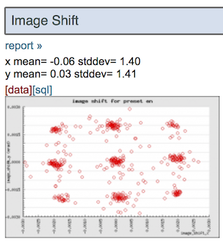

Since it is possible to refine beam tilt values of a group of micrographs against 3D model with Relion 3, it is desirable to download either the beam-image shift (or called user image shift in TFE instrument) values for each micrographs regardless of viewer image status. There are several ways to do this.

## Image shift values through session summary page (beta and 3.5+)

1.  Click on [summary] tag in myamiweb imageviewer. This takes you to the session summary with many statistics.
2.  Click on [data] tag under Image Shift of the preset you need information from.
    

## Beam tilt values through Appion ctf summary page (3.4+)

If the image-shift coma is calibrated on the scope in Leginon, this gives a relion3 compatible star file including the beam tilt expected according to the beam-image shift.
ctf estimation must be performed or transferred to the preset chosen.

1.  Select [processing] from myamiweb imageviewer for the Appion processing menu.
2.  Follow [appion:CTF Estimation](/leginon/appionCTF_Estimation) to download results for **download star file with expected beam tilt for Relion 3.0**
