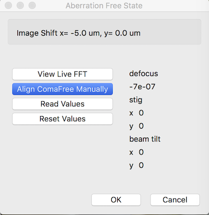
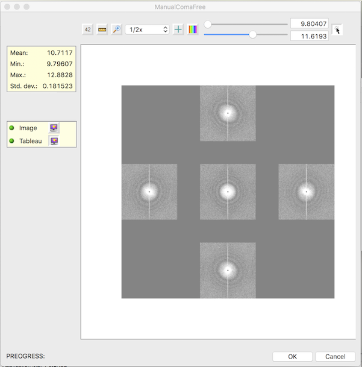

--0.7 um at 1.05 Å/unbinned pixel works well. Use MF tool in a Focuser node to check this before calibration. Write down the radius of the Thon ring node or take a screen shot. This will help setting the value at each image-shift.

I typically use bin 2 and center square region such as 1024x1024 on Ceta camera as preset.

Iterate these steps during the calibration. The aim is to have a coma-free and stig-free image at the same defocus as your image-shift free state.

1. Use "Vew Live FFT" tool to see power spectrum and adjust objective stigmator and defocus to be a good starting value such as about --0.7 um at 1.05 Å/unbinned pixel. You can also use other software to do this. **DO NOT RESET DEFOCUS**
2. Use "Align ComaFree Manually" tool to perform coma-free alignment manually.
3. Redo 1.

## Other tricks:

Daija Bobe wrote the attached docx documentation for SEMC with her own tricks.
