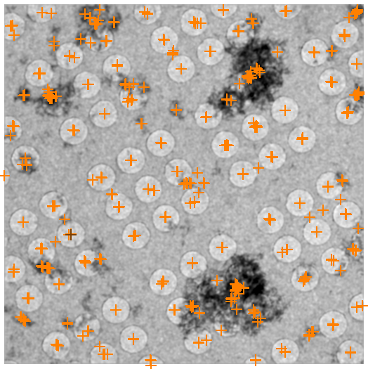
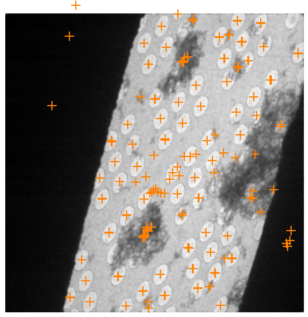
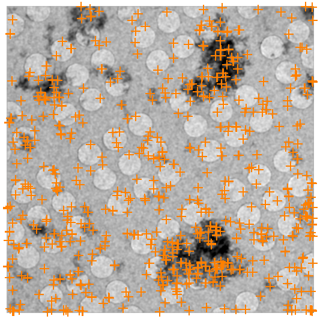
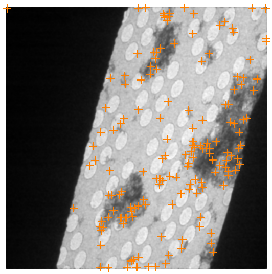

## Acquisition Settings that is unique to this node:

-   Move Type: **Must be stage position or modeled stage position**
-   [Iterative Stage Movement](/leginon/Leginon_Manual/Multi-Scale_Imaging_Applications_in_General/Iterative_Stage_Movement) Option is ON
-   Navigator Acceptable Tolerance should be set so that sufficient overlap between tilt pairs can be achieved.

## Testing feature finding algorithm

The default values in the RCT node may not work for your sample, trials should be made
to optimize the parameters. The good parameters should find hundreds, but not thousands of
features in your untilted image for good results.

1. Presets Manager> send the preset used in "Centered Square" to scope at the center
of a square.

2. RCT/toolbar> Click on the "acquire" button at the far right to acquire a test image
of which the feature finding algorithm will be applied after the acquisition.

3. RCT> Check the result of the numbers of feature found. A few hundred but not
thousands would be a good settings.

4. RCT/Settings> Adjust Min Feature Size (most sensitive) and/or Max Feature Size or
the filters and then repeat 2 and 3 to get better results.

 
Example of a good feature finding: There are good number of features. In addition, the obvious features, the center of most holes in the 3x3 hole patterns are identified. As a result, many of the features can be consistently identified after the distorting of tilting.

 
Example of a bad feature finding: Even though the number of features are in the hundreds, the obvious features are not found because both Min and Max Feature Sizes are set too small. As a results, most features are lost after tilting (2nd panel) and unrelated features are found instead.

-   Min/Max Feature Size: if < 1, it means faction of the image area. If > 1,
    number of pixels.

-   List of Tilts to Collect are in the order of data collection

-   RCT node has its own drift monitoring after each tilt at the transformed focus
    target position. Therefore, drift threshold and drift preset need to be defined.

*see also [RCT run protocol from a user](/leginon/Leginon_Manual/Leginon_MSI-RCT_and_MSI-RCT_raster_Applications/RCT_run_protocol_from_a_user)*

[< Best grids for RCT](/leginon/Leginon_Manual/Leginon_MSI-RCT_and_MSI-RCT_raster_Applications/Best_grids_for_RCT) | [Presets for MSI-RCT applications >](/leginon/Leginon_Manual/Leginon_MSI-RCT_and_MSI-RCT_raster_Applications/Presets_for_MSI-RCT_applications)
