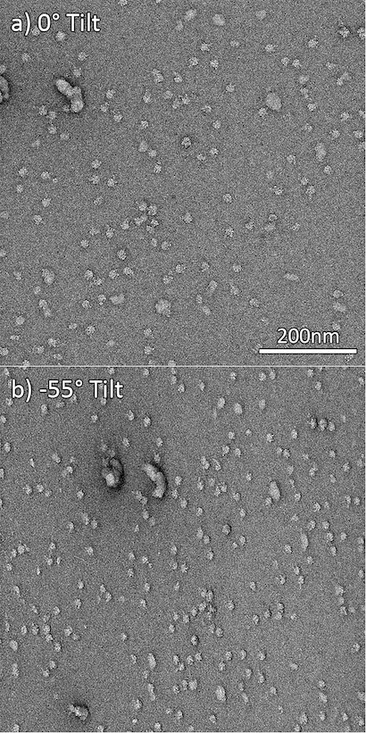

Since we will be doing 3D structure reconstruction on tilted images, the staining of the specimen needs to be very good to avoid bias in the tilted projection view.

Here are example images of a good image pair taken from Review by Tan et.al.(submitted). Two characteristics to look out for:

1.  The untilted images show even stain outside of the particles and the particle is negatively stained (i.e. whiter in digital camera images). If the stain is uneven, it may pile up around the particle. This will create a one-sided shadow when the grid is tilted. In this example, the stain does not cause much shadow on either side of most particles at --55 degree tilt.

1.  The interested particles are not badly flattened (You can see significant shadow on the right side of the large debris that we will not use for processing). Many proteins would be flattened to some extent, especially the hollowed ones. If the flattening is too strong, RCT will not yield sensible result. Thicker stain will result in less flattening, but too thick staining will make resolving the particles difficult.

