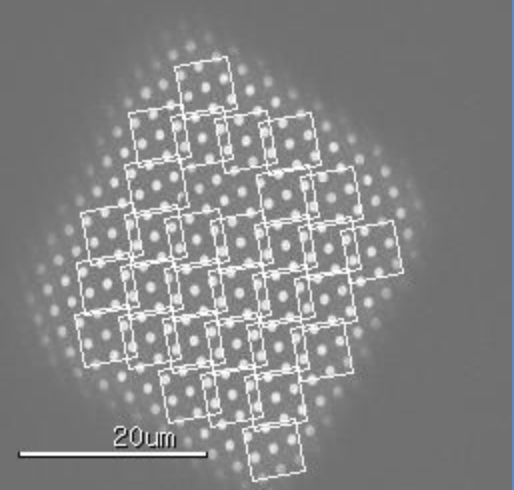
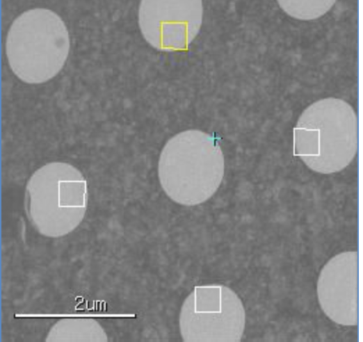

Tilted image data collection is used to broaden distribution of particle orientation distribution as described in Tan et. al. Nature Methods 14, 793--796 (2017) doi:10.1038/nmeth.4347.

The method works best with gold foil grids.

The workflow of this application is:

1.  Acquire the grid atlas untilted.
2.  Acquire an image at one selected grid square untilted and use that for eucentric height determination similar to "Z Focus" node typically of MSI-T application.
3.  Acquire an image at the same grid square at the desired tilt and select hl targets on that.
    
4.  The user should select focus target on hl image close to tilt axis to ensure best result either manually or automatically, but Leginon can handle some deviation from the tilt axis o.k.
    

This workflow is possible with pre-3.3 Leginon if they are done one square at a time. With the myami-3.3 or latest myami-beta version, and this new application, the targets selected on the tilted square images can be queued and Leginon can reliably return to the right z heigh and tilt to the same angle again regardless of the current tilt.
