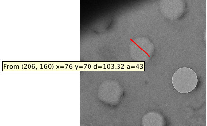
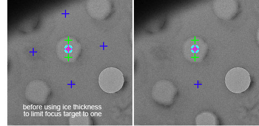

The same template hole finder class from Hole Targeting is used in Exposure Targeting for finding exposure and focus targets at higher magnifications by loosely defining some parameters. This set-up should be much easier and more stable than Hole Targeting. The parameters not mentioned here can be left at their default values. To proceed from one step of the exposure targeting process to another, simply proceed from top to bottom through the display selection buttons in the image control panel. The display settings associated with each display selection are the locations where the Hole Targeting parameters can be adjusted. To see the final acquisition and focus targets, enable only the Original, acquisition, and focus display selections.

## 1. Leginon/Exposure Targeting/Original>

Use this setting to load a test image if needed.

* Select the Image Display Selection before opening the Image Display Settings window.

* Browse the rawdata directory of the current session for an example image for testing.

* Load the selected file and exit Image Display Settings window.

* **If no file is selected while loading, an example hole image will be loaded.**

## 2. Leginon/Exposure Targeting/Template>

A good template gives a sharp correlation at the center of the holes.

* Measure the hole diameter with the ruler tool of the image viewer on any loaded original image of the hole to be tested.

* Select the Template Display Selection before opening the Template Display Settings window.

* Enter the path and filename of the hole template file if it is not set previously. The template is normally an average of several images of the hole of the same size and manufacturing method. The [Creating Template](/leginon/Creating_Template) section shows how the template come with Leginon is created. This default hole template has a diameter of 168 pixels.

* Enter the hole diameter of the template under "Original Template Diameter" in pixel.

* Enter the hole diameter of the hole in the test image under "Final Template Diameter" in pixel. The ratio of the two diameters causes a scaling of the template.
**Hint**: A larger final template diameter than the actual hole often give a sharper cross correlation peak.

* Choose a correlation method. "phase" correlation is the typical.

* Set the low pass filter = 2 or higher can reduce scattered sharp peaks found in phase correlation image.

* "Test" these parameters and adjust. We found that the best result often need the final template diameter to be set somewhat larger than the actual hole in the image.

## 3. Leginon/Exposure Targeting/Threshold>

A good correlation threshold leaves only small blobs of the correlation peaks from the hole(s). This parameter also tends to change during an experiment. In addition, the value is in the unit of number of standard deviation above the mean.

* Select the Blobs Display Selection before opening the Threshold Display Settings window.

* Enter the Threshold value determined in the previous section and press Test.

* Use the ruler tool to measure the diameter of blob that represents the center of the targeted hole. Square this number and use it in the next blob finding section if needed.

## 4. Leginon/Exposure Targeting/Blobs>

The Border is used here to prevent the selection of non-targeted holes that show up at the edge of the image.

* "Border" should be set at least the radius of the holes but not so large that the move error of the stage does not allow the targeted hole center to lie in the border.

* Maximum number of blobs = 1 since only one hole should be targeted at a time.

* "Maximum size of blobs" should be adjusted until only the hole centers are shown. A starting value is the measured blob diameter value measured in the previous section.

* "Test" and adjust the parameter in this and the last three steps to obtain the best results. Ideally, only the targeted hole should be shown and selected.

## 5. Leginon/Exposure Targeting/Lattice>

This step is used here only to remove multiple blobs found close to the center of the targeted hole.

* Spacing= any number.

### (version 3.5 New feature) Set Spacing to 0 allows all blobs as lattice point for stats calculation. Useful for gold foil grids with hexagonal packing or tilted grids.

* Reference Intensity: The mean intensity measurement from an empty hole at the same preset (hole). If not measurable, use a high estimate here would be ok for relative setup.

* "Test." The correct setting leaves only one target.

## 6. Leginon/Exposure Targeting/acquisition>

No discrimination of holes is needed here. This step will set-up the template for exposure and focus targets.

* For example, Minimun ice thickness = 0.01, Maximun ice thickness = 5.0, Maximum Stdev = 2.0

* "Test" to check if the target passes the criteria.

* Use target template = yes

* Set up the template with a list of coordinates relative to the current hole target center. For example, for an acquisition target at the same place as the "good hole" target should have x,y coordinates as 0,0. Add, Edit, and Test the Acquisition and Focus Target Template.

* Use template to create several posible positions around the hole for focus and then use ice thickness as criteria to use the first valid one as the focus target. This way, it can avoid thick area or area with contamination.

## 7. Leginon/Exposure Targeting/Settings> Activate automatic hole finding for future images received.

Skip automatic hole finding = no

[< Hole Targeting Set-up for MSI-T](/leginon/Leginon_Manual/Leginon_MSI-T_Application/Hole_Targeting_Set-up_for_MSI-T)
