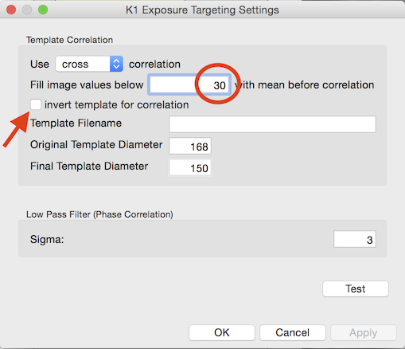
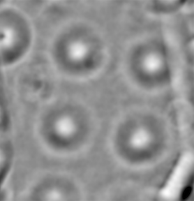
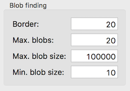
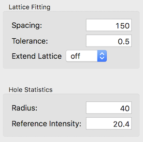
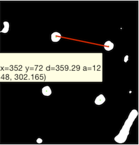
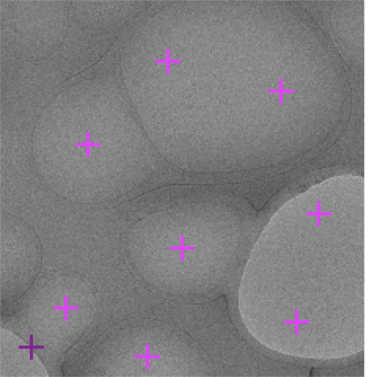
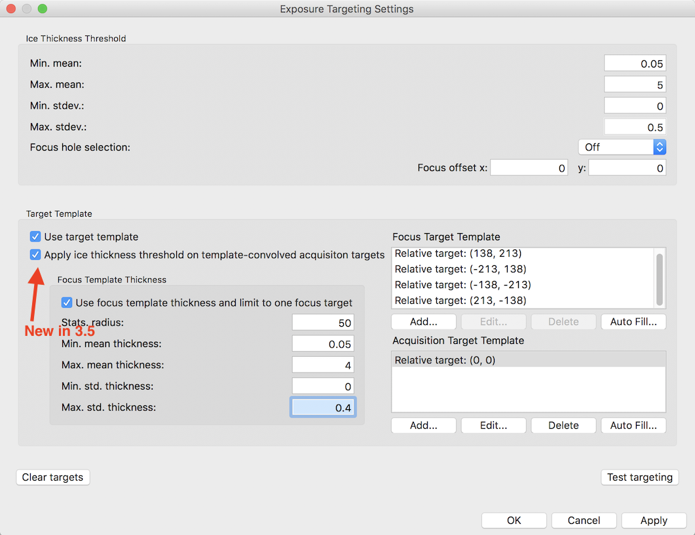
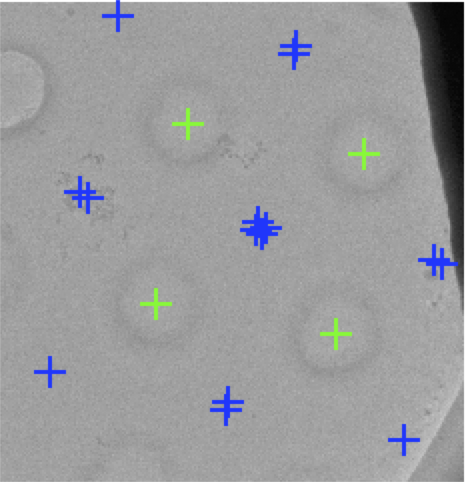

[New Exposure Targeting Set-up in MSI-T for Multiple holes](/leginon/Leginon_Manual/Leginon_MSI-T_Application/Exposure_Targeting_Set-up_for_MSI-T_for_Four_holes/New_Exposure_Targeting_Set-up_in_MSI-T_for_Multiple_holes)

A good way to improve the throughput if there are multiple holes visible in a hl image is to target all four holes.

We can set up for 4 holes with this more challenging example:

## About this image:

This image shows the edge of the grid bar. The intensity at edge of the grid bar has a mean around 20 while the rest has a mean around 45. The four holes are reasonably centered.

## Leginon/Exposure Targeting/Template>

-   Cross correlation works better than phase correlation in this case because the hole does not have sharp edge and not perfectly round.
-   Adjust the value to fill the mean before correlation to minimize the correlation along the edge of grid bar.
-   Invert template for correlation if needed.

 

## Leginon/Exposure Targeting/Threshold>

-   Fairly easy to set.
     

## Leginon/Exposure Targeting/Blobs>

-   Allow more blobs than the intended 4.
-   Use border to eliminate those too close to the edge.
     

## Leginon/Exposure Targeting/Lattice>

-   Similar to that in Hole Targeting/Lattice step.
    -   Make measurement of the lattice distance
    -   Estimate the reference intensity for ice thickness filter.
          

## Leginon/Exposure Targeting/Acquisition>

-   Set up focus template but DO NOT eliminate focus targets using ice thickness criteria. This works because Leginon (3.1 and above) will automatically choose the center most focus target.
-   (3.5 and above) Activate "Apply ice thickness threshold on template-convolved acquisition targets" allows filtering of each convolution generated holes.

 
