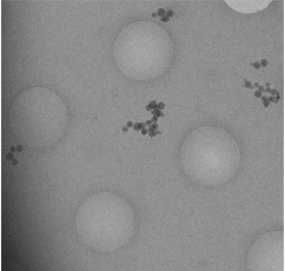
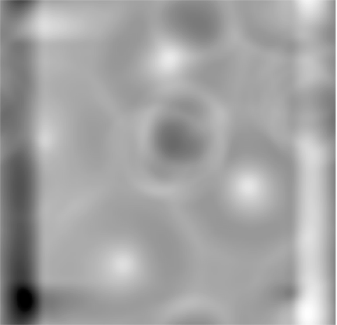
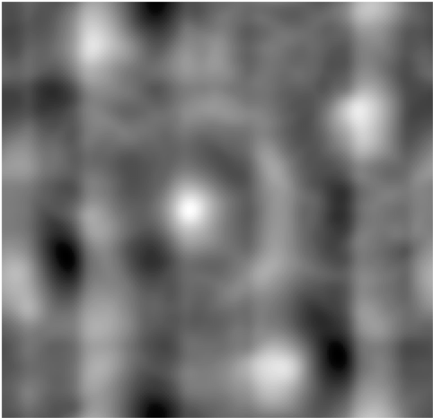
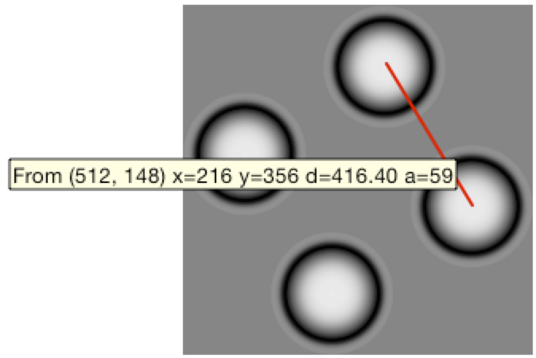
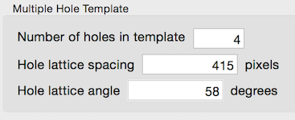

A few new options are added to Template step to define a multiple hole template is added to help harder cases of multiple hole template correlation.

The image below captures 4 holes.

There is enough gradient in the image that the correlation of the holes do not stand out as shown here:

WIth a template that contains 4 holes, the correlation peak at the center of the 4 holes are much stronger.

The 4 hole template is created by specifying the lattice spacing the angle of the vector from one hole to the next, as shown in the measurement on the template generated below.

The spacing and vector angle are enterred in Template Settings like this:

Once the center of the 4 holes are defined in the correlation, the targets can be defined relative to it with a convolution similar to defining multiple targets in one lattice hole.
