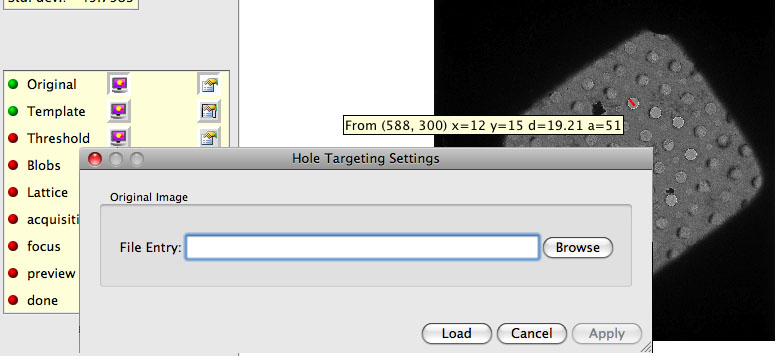
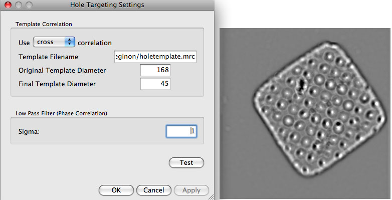
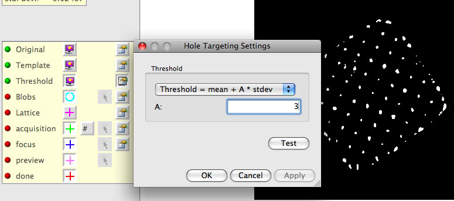
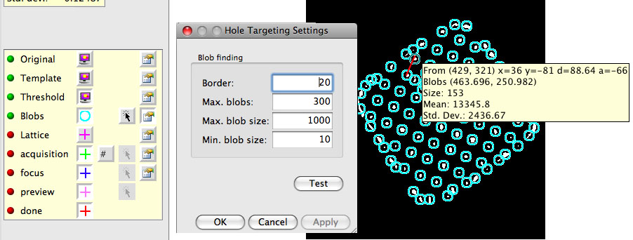
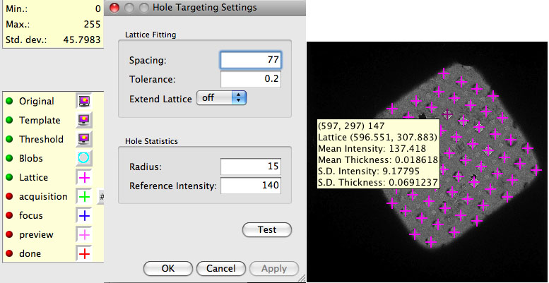
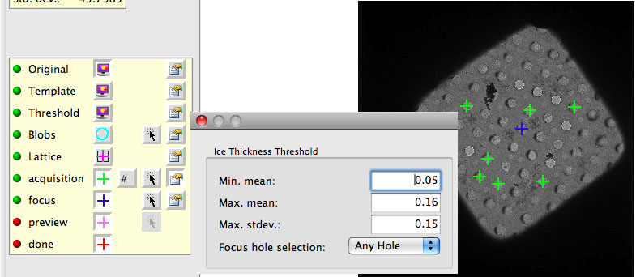

If you change the value and test an earlier step, you must redo all subsequent steps without skipping.

## 1. Leginon/Hole Targeting/Original>

Use this setting to load a test image if needed.

* Select the Image Display Selection before opening the Image Display Settings window.

* Browse the rawdata directory of the current session for an example image for testing.

* Load the selected file and exit Image Display Settings window.

* **If no file is selected while loading, an example square image will be loaded.**

## 2. Leginon/Hole Targeting/Template>

A good template gives a sharp correlation at the center of the holes.

* Measure the hole diameter with the ruler tool of the image viewer on any loaded original image of the hole to be tested.

* Select the Template Display Selection before opening the Template Display Settings window.

* Enter the path and filename of the hole template file if it is not set previously. The template is normally an average of several images of the hole of the same size and manufacturing method. The [previous section](/leginon/Creating_Template) shows how the template come with Leginon is created. This default hole template has a diameter of 168 pixels.

* Enter the hole diameter of the template under "Original Template Diameter" in pixel.

* Enter the hole diameter of the hole in the test image under "Final Template Diameter" in pixel. The ratio of the two diameters causes a scaling of the template.
**Hint**: A larger final template diameter than the actual hole often give a sharper cross correlation peak.

* Choose a correlation method. "phase" correlation is the typical.

* Set the low pass filter = 2 or higher can reduce scattered sharp peaks found in phase correlation image.

* "Test" these parameters and adjust. We found that the best result often need the final template diameter to be set somewhat larger than the actual hole in the image.

## 3. Leginon/Hole Targeting/Threshold>

A good correlation threshold leaves only small blobs of the correlation peaks from the holes. Since the peaks from holes with ice are usually weaker but more important to catch, it is o.k. to leave some but not too many noise peaks. This parameter also tends to change during an experiment. The value is in the unit of number of standard deviation above the mean.

* While the template correlation image is displayed, find out the value of the correlation peaks using the information tool (with 42 shown on the button)

* Select the Threshold Display Selection before opening the Threshold Display Settings window.

* Enter the absolute or relative threshold value and press Test.

## 4. Leginon/Hole Targeting/Blobs>

If the threshold level from the last step is too low, there will be a lot of big blobs, making the process slow. The parameters set in this node reasonably limit the total number of blobs.

* Select the Blob Display Section before opening the Blob Display Settings window.

* "Border" should be set to at least the radius of the holes in order to reduce the border effects.

* "Maximum number of blobs" is typically 300 (although it is sometimes larger if you expect more holes).

* "Maximum size of blobs" should be adjusted until mostly hole centers, not junk spots, are shown.

* "Test" and adjust the parameters in the last three steps (2-4) to acheive the best results.

* To help define the lattice, measure the distance between hole centers with the ruler tool.

## 5. Leginon/Hole Targeting/Lattice>

The lattice of the holes is not perfect; therefore, a decent tolerance is necessary for a good fit to this imperfect lattice. If only a few blobs were centered in the last step, then this step is not likely to work.

* Select the Lattice Display and Original Image Display before opening the Lattice Settings dialog.

* Enter the Spacing from the measurement in the last step.

* Typical Tolerance = 0.1 (i.e., 10% error in the spacing is accepted)

* Hole Stats Radius = ~ 3/4 of the hole radius.

* Zero thickness (I0) = the intensity measurement from an empty hole at the same preset (the sq preset).

* "Test"

* Close the settings dialog and examine the "mean thickness" and "standard deviation of thickness" in each hole on the lattice by activate "42" tool and move the curser close to the center of a lattice target.

## 6. Leginon/Hole Targeting/acquisition>

The settings here depend on the required ice thickness and on the "Zero thickness" setting in the last step. At a minimum, these settings can be used to rule out holes that are empty and that have massive ice contaminant.

* Select the Original and acquisition Display Sections before opening the acquisition Display Settings window.

* mean and standard deviation are measured by ln(I0/I)

* Focus hole selection = Good hole ( or "Any Hole" if hole targets are not plentyful. With "Any Hole" option,and a bad hole may be targeted that is hard to focus such as very thick ice. Alternatively, "Off" to skip the Z height correction step at each square )

* Use target template = no

## 7. Leginon/Hole Targeting/focus>

The only relevant focus setting ("Focus hole selection") in Hole Targeting is in relation to Z Height correction. The Leginon/Hole Targeting/focus Display Settings window = Leginon/Hole Targeting/acquisition Display Settings window. This means that the focus settings were set in the previous section and do not need to be revisited here. To see the focus targets, enable the Original and focus (and optionally the acquisition) display selections in the image control panel.

## 8. Leginon/Hole Targeting/Settings> To activate automatic hole finding for future images received.

Skip automatic hole finding = no

[< Creating Template](/leginon/Creating_Template) | [Exposure Targeting Set-up for MSI-T >](/leginon/Leginon_Manual/Leginon_MSI-T_Application/Exposure_Targeting_Set-up_for_MSI-T)
