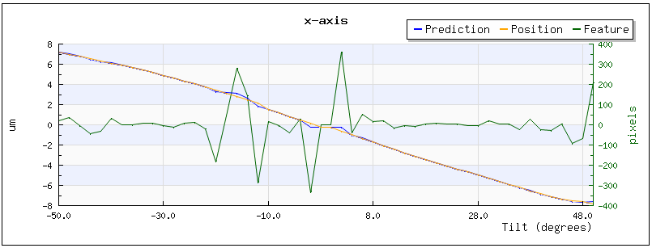
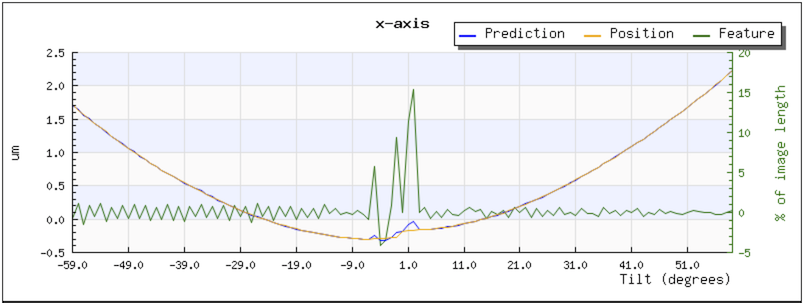

The graphs found in http://your_host/myamiweb/tomography/ are very useful for trouble shooting.

## Basic tracking graphs

Figure 1 shows a typical result.

**Figure 1**

-   x and y axes contains the tilt axis and are referenced to columns and rows on the images acquired.z-axis is parallel to the electron beam.

-   The "Prediction" data in the x and y-axis plot is the extrapolated result of the smooth curve fitting from preceding (usually 4) tilts to the current tilt angle.

-   The "Position" is where features on the specimen end up to be relative to the origin of the image shift at the scope as determined by correlation of images. Both "Prediction" and "Position" are expressed in microns.

-   The "Feature" is the shift of the feature on the image. It corresponds to the difference between "Prediction" and "Position" and is expressed in pixels of the image acquired.

-   The z-axis "Prediction" is the correction of defocus, i.e., specimen z-height change, the current model suggests and applied for each tilt angle to keep the specimen focused. Originally, it is possible to measure defocus at each tilt and obtain "Measured" values in this plot. However, the function is currently disabled because the procedure does not give accurate results.

## Model Parameters

By activate "show model parameters" check box in the viewer, more plots are shown (Figure 2).

**Figure 2**

phi is the angle between the tilt axis with y-axis. offset is the distance between the tilt axis and the CCD center, z0 is the height difference between eucentric point and the untilted specimen.

To first approximation, if the object tomography application try to track is perfect in xy but off in z ( off eucentric, shown as z0 in the model parameter), the movement of the z-projected object during tilting follows a sine curve. On the other hand, if the object is perfect in z but offset on the xy plane in direction perpendicular to the tilt axis, the movement of the projected object follows a cosine curve, as shown here:

Therefore, the curve below on x-axis which is almost perpendicular to the tilt axis (phi ~ 0) suggests the specimen is 10 um ( = 7 um / sin(45 degrees) ) off in z and the tilt axis passes quite close to the center of the CCD.

On the other hand, the curve below on x-axis suggests that there is an offset of the tilt axis from the center of the camera at 4 um for negative tilts and 4.8 um for positive tilts. This is because geometrically, if the offset is R, the distance it moves relative to the position at 0 tilt is

    R * ( 1 - cos( tilt )

which is 0.5 * R at 60 degree tilt. The x value is --0.3 um around zero going negative direction, and is 1.7 um around --60 degrees. That means the difference is 2.0 um, thus R = 4 um.

[< Running the application](/leginon/Leginon_Manual/Leginon_MSI-Tomography_Application/Running_the_application) | [Fitting the tilt axis model >](/leginon/Leginon_Manual/Leginon_MSI-Tomography_Application/Fitting_the_tilt_axis_model)
