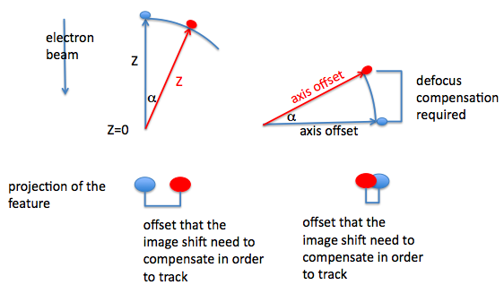

## Import Notes about Image Intensity Recorded through Tomography Node

Tomography node saves the images in a different format from other Acquisition nodes. By
default, the flat-field correct CCD counts are multiplied by 10 and converted to signed
16-bit integer before the image is displayed and saved. This makes CCD counts of 3276.8 or
larger overflow to negatives. Other Leginon Acquisition images are saved as float without
manipulation.

To avoid this problem, find out what exposure time corresponds to the fractionated dose
from your tilt angle step and range and total dose and take an image at tomo preset with
such an exposure in Navigation node. You will need to reduce the total dose if a good
fraction of the counts are larger than 3200 even though it would not appear to be saturated
in the float scale without the 10x factor. Alternatively, change the scale factor in
Tomography node.

## Multiscale Imaging

-   Preset image shift alignment/beam shift alignment are the same as in MSI
    application

-   New dark/bright references should be reacquired for "tomo" preset that acquires the
    final data. It is best to do this at the same dose per tomography image calculated from
    the total dose, the tilt parameters, and the dose measurement.

-   For best focusing result, perform autofocus at the same magnification as the
    tomography data collection, align microscope well at the eucentric focus and the
    rotation center and save them before data collection.

## Using Tomography Preview

-   Preview targets (pink) can be selected when selecting targets in "Tomography
    Targeting"

-   When the targets are processed, targets that are of the type "preview" are
    processed before focus and acquisition targets.

-   Tomography Preview node acquires a image at the preview target using "preview"
    preset which should be set at minimal dose.

## Dose Measurement (optional)

If "Measure Dose before collection" is checked in Tomography node, the stage will be
moved to the reference target and a dose image of the "tomo" preset will be acquired (center
512x512 of whateven binning of the preset) before each tilt series if the interval between
the series is longer than the limit time set in the settings of Dose Measurement node. The
measured value will then be used to recalculate the proper exposure time for tomography
imaging.

For this function to behave properly, the followings should be done during
operation:

-   One, and only one, "reference" target should be selected in either "Square
    Targeting" or "Hole Targeting" or "Tomography Targeting" node. The reference target
    should be of either a broken square or a empty hole if no broken square can be
    found.

-   "Measure Dose" before collection should be selected in Tomography node.

-   "Exposure time max/min" in Tomography node should be in a range that can accommodate
    the electron beam fluctuation over time. This value is evaluated after integer conversion and scaling.

## Align Zero Loss Peak

This function applies only to Gatan energy filter EFTEM. If "Align ZLP before
collection" is checked in Tomography node, the stage will be moved to the reference target
and starts the procedure to align zero loss peak before each tilt series if the interval
between the series is longer than the limit time set in the settings of Dose Measurement
node.

For this function to behave properly, the followings should be done during
operation:

-   One, and only one, "reference" target should be selected in either "Square
    Targeting" or "Hole Targeting" or "Tomography Targeting" node. The reference target
    should be of either a broken square or a empty hole if no broken square can be found.
    This is the same reference target used for dose measurement.

-   "Align ZLP" before collection should be selected in Tomography node.

## What is a Good Tilt-Axis Model?

We recommend using a fixed model by activate "Keep the tilt axis parameters fixed" in the model section of
the Advanced Tomography Settings. A well-serviced microscope is likely to have tilt axis very close to
the center of the camera. Therefore the default "custom values" of 0's is likely usable.

The goniometer-tilt-axis-based tracking model developed by Zheng et. al. corrects the
specimen height (z-axis) by a change of defocus using measured shift of feature shifts in
the images (x and y-axes). The tracking in the x and y directions does not involve the use
of such model, but is done by smooth curve fitting or preceding tilts. Therefore, to judge
the adequacy of the model, one should check the resulting defocii of the images in the
series remain unchanged.

On the other hand, the feature tracking in x and y is likely to fail only if the tilting
does not induce a smooth shift of the imaging feature a sudden drop of specimen position at
a particular tilt angle often throws off the smooth curve fitting. It is possible to reduce
such effect by increasing the number of data points included in the smoothing as set in the
model section of the tomography node settings window. Otherwise, the goniometer need to be
serviced.

[Tomography Trouble Shooting](/leginon/Leginon_Manual/Trouble_shooting/Troubles_with_Tomography) section covers many of the problems we have encountered.

[< Set-up Before Running](/leginon/Leginon_Manual/Leginon_MSI-Tomography_Application/Set-up_Before_Running) | [Reading the tomography graphs >](/leginon/Leginon_Manual/Leginon_MSI-Tomography_Application/Reading_the_tomography_graphs)
