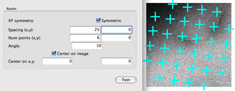
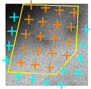
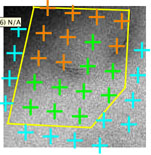
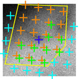

The user should setup the presets and the preference configuration of the nodes in MSI raster application in the way identical to MSI application. Since MSI raster application is used when continuous carbon support is used rather than holey film, the name of the nodes are changed accordingly so that the node "Hole Targeting" in MSI is now "Sub-Square Targeting" and "Hole" is now "Sub-Square". Both "Sub-Square Targeting" and "Exposure Targeting" nodes are now derived from "raster finder" node class and the following set-up apply to both nodes.

## Initial Raster Finder Preference Setup in MSI-raster

Subsquare Targeting/Settings and Exposure Targeting/Settings>

-   Allow for user verification of picked holes = yes

-   Queue up targets = no

-   Declare drift when queue is submitted = yes (default)

## Raster Finder basics

Raster finder works in five steps:

1. It creates raster points on the image defined by the center, the spacing between the points and the angle of the raster axis from the image axis. Number of points defines the number across each raster axis. The total number of raster points are also limited by the image size as no raster point is allowed outside the image.

A symmetric raster has equal spacing and number at both raster axis. If symetric is chosen, only x spacing and number need to be entered.

2. If an image acquired is loaded, it is possible to calculate the best spacing and angle to achieve a desired overlapping image. The calculator uses the preset used in the loaded image and the preset with which the raster images will be collected and their calibrations for the move type the raster targets will be moved by.

3. A polygon can be drawn by the user to limit the raster region that will be considered in the later steps. This is used mostly with tissue section imaging. No limit is imposed if no polygon points are picked on the image.

4. Ice thickness is used to limit the valid raster points to usable region.

* Box size = a boxed area around the target used to determine intensity statistics
* Reference Intensity (I0) = the intensity measurement from an empty hole at the same preset of the image to be analyzed. If there is no empty hole, maximum image intensity of the image can be used as a guess.
* mean, and stdev. are in a scale of ln (I0/I) where I is the image intensity in the box

In this case, the chosen max mean eliminates the dark area, and the chosen max stdev removes the edge of the hole as target to be considered.

5. Target templates are applied to the valid raster points to create the final acquisition and focus targets. The template can be constant, meaning that it is defined relative to the image coordinate. The template can also be convolved with the raster points which will create multiple targets, each defined relative to the coordinate of the valid raster points.

In this example, the acquisition targets are convolved with a relative target at (5,5), the focus target is a constant target at (70,70)

## Select a raster on the first image of a square

Select a raster arrangement to collect data from by making selections on the first image of a square.

1. Go to Leginon/Sub-Square Targeting> It should display the current square image. If not, following MSI operation instruction on [Selecting Squares on Atlas](/leginon/Leginon_Manual/Multi-Scale_Imaging_Applications_in_General/MSI_Operation#Select-Squares-on-the-atlas).

2. If the target selection is acceptable, uncheck User Check in Leginon/Sub-Square Targeting/Toolbar/Settings>.

**For repeated experiments of the same type of sample and grid on the same scope and presets, Reference Intensity in "Acquistion or Focus Settings/Ice Thickness>" should be the only parameter that requires adjustment from day to day.**

3. If the target spacing or orientation is not acceptable, try adjusting the Raster Finder to find holes in the current image of a square.

* Display the raster (sky-blue cross hairs) and then open raster setting window next to the display selection panel.
* Leginon/Sub-Square Targeting/Raster Setting>
Choose a Raster Spacing that makes sense with the overlap of the beam, e.g. 100+ or use the "Spacing/Angle Calculator" to achieve a desired overlap. Note that Raster Preset and Move Type are those set at "Subsquare" node.
Increase raster spacing if there is too much overlap of imaging area for the next preset. Decrease number of points if the square opening is much smaller than the square image or if there is no need to explore all area of the square. Angle the raster to either fit the square best or to create optimal coverage.
**Test the parameters in the setting window and check the results on the node image display panel. Click on O.K. to save and leave the setting window.

* Although polygon tool can be used to limit region, "Ice thickness" tool in exposure/focus selection is better for avoiding grid bar. No limit is set to the raster region if no vertices are picked.

Check the polygon raster (orange cross hairs) by clicking on "test" to continue to next step

If the polygon need adjustment for each future image, turn on "Wait for polygon selection".

4. If the exposure and focus selection is not acceptable, try adjusting the Raster Finder to pick the correct targets.

* Undisplay the raster (sky-blue cross hairs) and polygon raster (orange cross hairs) by clicking on the display selection again. Alternatively, click on both Acquisition and Focus target display selection twice to move them to the top layer of the display.

* Hover the mouse over the image in the display panel of the node to find the maximum and average intensity value of the usable region.

* Find a Focus position (e.g. (360,145) ) on the image that will be entered in Focus Targets/Constant Template>.
Hover the mouse over the image with the "42" button enabled where the Focus position is desired.
The (x,y) value that appears over the image is the value that should be entered in the Focus Targets/Constant Template area.

* Leginon/Sub-Square Targeting/Acquisition or Focus Setting>
Enter a value above the maixmal intensity found in the previous step into the Reference Intensity field in /Ice Analysis>.
Click "Test" and check the raster arrangement that passed the intensity analysis test. Adjust the Reference Intensity value to match your own assessment. You may also change the ice thickness max, min, and standard deviation threshold to rejects area with stain that is too thick ,too light or too uneven, respectively.
Select target templates to modify the targeting scheme. A constant Focus template for Z focus should be included. The automatic focus targeting routine found in hole finder is not yet implemented in this node class. Click on "Test" to test the template before saving and leaving the setting window.

5. Click Submit (in Leginon/Sub-Square Targeting/Toolbar> to process the final targets.

6. If the target selection is acceptable, uncheck User Check in Leginon/Sub-Square Targeting/Toolbar/Settings>.

## Select Exposure and Focus targets on the first Sub-square image

Pick exposure and focus targets on the first hole preset (Sub-Square) image. The aim is normally to image all area on the sub-square image at higher magnification after a fine-focusing procedure.

1. Go to Leginon/Exposure Targeting> It should display the current Sub-Square image

2. Check whether exposure (red cross hair) and focus (blue cross hair) targets were selected correctly (in the correct raster fashion).

3. If the target selection is acceptable, uncheck User Check in Leginon/Exposure Targeting/Toolbar/Settings>.

4. If the target selection is not acceptable, try adjusting the Raster Finder to find holes in the current image of a sub-square.

* The procedure is similar to the process of setting up for Sub-Square Targeting.

5. Click Submit in Leginon/Exposure Targeting/Toolbar> to process the targets.

6. If the target selection is acceptable, uncheck User Check in Leginon/Exposure Targeting/Toolbar/Settings>.

[< Summary of this application](/leginon/Leginon_Manual/Leginon_MSI-raster_Application/Summary_of_this_application_-_MSI-raster) | [Queuing Option >](/leginon/Leginon_Manual/Leginon_MSI-raster_Application/Queuing_Option_-_MSI-raster)
