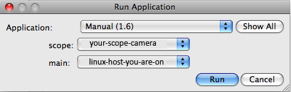

## Microscope Setup

1.  Setup normal or low dose mode configuration.
     
2.  Align the scope.

## Run Leginon Client on the Microscope/Camera Computer

See Instruction in "Start Leginon" Chapter about [Run Leginon Client on the Microscope Computer](/leginon/Run_Leginon_Client_on_the_Microscope_Computer)

## Start Leginon

See Instruction in "Start Leginon" Chapter about [Run Leginon at your main working station](/leginon/Leginon_Manual/Start_Leginon/Start_Leginon_at_your_main_working_station_remotely)

## Launch the Application

Leginon/Main menu/Application> select "Run...." and choose the application named "Manual", select the microscope/camera hostname for "scope" and the local computer as "main", and then launch the application. See [Using Leginon on a system where the microscope and camera are controlled by different computers](/leginon/Using_Leginon_on_a_system_where_the_microscope_and_camera_are_controlled_by_different_computers) if your camera and microscope are controlled by two computers.

[< The Application](/leginon/Leginon_Manual/Leginon_Manual_Application/The_Application) | [Running "Manual" Application >](/leginon/Leginon_Manual/Leginon_Manual_Application/Running_Manual_Application)
