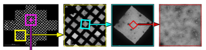

This application is mainly a shortened MSI application without any focusing and limit the imaging to intermediate mag.

Images taken are:

1.  a small atlas of gr images.
2.  one sq image with intact support film and reasonable stain located closest to the center of each gr images.
3.  raster of hl images sample different area on the grid square.

## Square Target Filtering:

Square Target Filtering node belongs to CenterTargetFilter Class and is unique to "Robot-MSI-Screen 1st Pass" application. It filters the centerred most target per parent image so that the screening samples are spread out through the grid. If you want more targets to pass through, simply increase the value in its settings. This is unique for this application.

## Node Classes, function, and corresponding node in other MSI's:

Refers to MSI-Raster or MSI in General for the functions of the following nodes

-   Robot Node -> Robot2 Class: Managing grid insertion/extraction and labeling.

-   Grid Survey Targeting Node -> AtlasTargetMaker Class: Equivalent to Grid Targeting in MSI but no mosaic label is required and of a smaller area for efficiency.

-   Grid Survey Node -> Acquisition Class: Acquire images like Grid node in MSI but processing more like Square node by publishing the image directly to a target finder.

-   Square Targeting -> JAHCFinder: Find squares by a template, a round hole template is good enough. Settings similar to Square Targeting in MSI-T to discriminate against bad stain and broken grid squares.

-   Square Target Filtering-> CenterTargetFilter Class: Filter the centerred most target per parent image so that the screening samples are spread out through the grid. If you want more targets to pass through, simply increase the value in its settings. This is unique for this application.

-   Mid Mag Survey Targeting -> RasterFinder: Sample the square by raster points. Settings similar to Subsquare Targeting or Exposure Targeting nodes in MSI-Raster. However, no focus target is needed.

-   Mid Mag Survey -> Acquisition: Acquire images like Hole node in MSI but without further processing as in Exposure. It also ignores focus targets if accidentally chosen.

[< Robot node](/leginon/Leginon_Manual/Leginon_Robot-MSI-Screen_Applications/Robot_node_set-up) | [Evaluation application >](/leginon/Leginon_Manual/Leginon_Robot-MSI-Screen_Applications/Evaluation_application)
