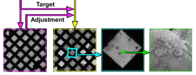

This application transforms the targets selected from Evaluation according to the rotation and shift of the second grid insertion and acquires high mag images with focusing.

Images taken are:

1.  center-most gr image to find rough grid transformation caused by re-insertion.
2.  gr image on which the target is selected acquired after the re-insertion transformation.
3.  sq image based on the target.
4.  autofocusing images
5.  raster of en images based on the target.

## 2nd Pass Targeting Node:

"2nd Pass Targeting" node is unique to "Robot-MSI-Screen 2nd Pass" application. It displays the grid atlas from the first pass and the targets selected on them. It also allows editing of the targets. Once submitted, it alsow perform the acquisition of an initial gr image for target transformation and the calculation and application of the transformation. The refresh tool is used to refresh target status and the submit tool for starting target processing.

## Node Classes, function, and corresponding node in other MSI's:

Refers to MSI-Raster or MSI in General for the functions of the following nodes

-   Robot Node -> Robot2 Class: Respond to the grid insertion request by "2nd Pass Targeting" node.

-   Reacquisition Node -> Acquisition Class: Equivalent to Square node in MSI. The target it receives is a transform of the target selected on the 1st pass "gr" image.

-   Grid Survey Node -> Acquisition Class: Acquire images like Grid node in MSI but processing more like Square node by publishing the image directly to a target finder.

-   Square Targeting -> JAHCFinder: Find squares by a template, a round hole template is good enough. Settings similar to Square Targeting in MSI-T to discriminate against bad stain and broken grid squares.

-   Screen Z Focus-> Focuser Class: Multiple focus sequence aim to bring the grid to focus. The focus sequence is a combination of Z Focus and Focus nodes in MSI.

-   High Mag Raster Targeting -> RasterFinder: Close-coverage sampling of the center of the parent image by raster points. The size of the raster is determined by the accuracy of the targeting and transformation. A focus target should be chosen here.

-   High Mag Survey -> Acquisition: Acquire the final images like Exposure node in MSI.

[< Evaluation application](/leginon/Leginon_Manual/Leginon_Robot-MSI-Screen_Applications/Evaluation_application)
