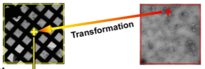

This application is for user-interactive target selection of "sq" and/or "hl" images aquired the Square and Mid Mag Survey. The results are transformed onto "gr" images since the 2nd pass targeting is done on the grid atlas. It only has one node: "2nd Pass Targeting"

## Settings:

Choose from "sq" and "hl" presets as the child images where the targets are selected and transformed from.

"gr" preset should always be selected as the preset of the ancestor images where the targets are transformed to.

You may enter an image to start the selection process.

## Tools:

The images are chronological ordered.

-   To Beginning: .

-   Previous: .

-   Next: .
    It can also be used for starting the first loading.

-   To End: .

-   Jump to specific file as indicated in the settings: 

-   Transform targets from child image to ancestor image: 
    This tool should be clicked after targets are selected, modified, or cleared on the child image. You may add c_acquisition(i.e., child acquisition) or remove transformed target on the child image, but not directly modify the acquisition targets on the ancestor. The latter can only be modified by first modify the targets on the child, and then re-transformed.

-   Clear: 
    This is used to clear all targets on the child image. Transform is still needed to clear those shown as ancestor acquisition targets.

[< 1st Pass application](/leginon/Leginon_Manual/Leginon_Robot-MSI-Screen_Applications/1st_Pass_application) | [2nd Pass application >](/leginon/Leginon_Manual/Leginon_Robot-MSI-Screen_Applications/2nd_Pass_application)
