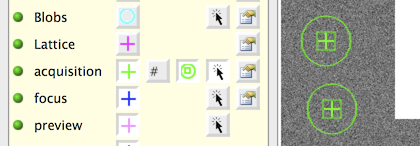

This feature displays the approximate imaging area (maximal of the image length) on the parent image where its target is selected.

Calibration of the beam size is required at the spot size where the child preset (the preset the target will be acquired at).
