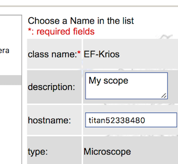

[Slack](https://slack.com) is a team communication software that we use among SEMC/NRAMM staff. Leginon now sends message to configured channel when it encounter errors (those shown as Error (red background stop sign) in logger.

To activate this feature, you need Leginon 3.3 and up, and follow the steps:

1. [install slackclient](/leginon/Extra_supporting_package_table) on your Leginon processing server

2. create An Application in your Slack workspace and configure slack.cfg as shown in the attached presentation: (click on "Files" tag below to show the link if you do not see the file)

3. As a user in administrator group in leginon/appion, log in myamiweb and add a more friendly name to your scope instrument in your myamiweb/updateinstrument.php

4. [Activate Slack notifications in Leginon](/leginon/Leginon_Manual/Leginon_System_version_33/New_User_Features_33/Slack_notification_for_Leginon_errors/Activate_Slack_notifications_in_Leginon) session.
