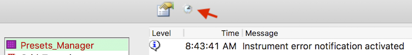

Once you have finished automated setup and about to walk away, click on the stopwatch tool in PresetManager.
It is a toggle button. When the logger info gives you "Instrument error notification activated", any error log in Leginon will be sent to the default channel defined in slack.cfg.

Click the tool again deactivates it. Closing and restart Leginon also resets it to deactivated state.

