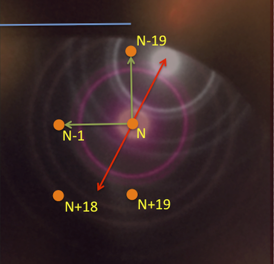

Thin-carbon hole-free phase plate such as FEI Volta phase plate generate phase shift from the phase shift differential between the irradiated point from its surrounding. When we perform beam-tilt-based autofocus, the beam tilt angle need ideally outside of the information forming area, roughly 2 Angstroms resolution scattering distance. A 10 mrad beam tilt typically used in Leginon is suitable for the purpose with a few modifications.

## Diagonal Beam Tilts

The figure below shows the original beam tilt method and the modification for phase plate.

A phase plate is imaged in diffraction mode with a cross-grating replication in on-plane position in this figure. The magenta diffraction rings from gold are centered at a hypothetical patch position numbered N, shown as an orange spot. For reference, the positions of a few surrounding patch positions are also shown. The patch position is laid out such that a line connection N-1 and N is parallel to the straignt edge of the phase plate slot, its direction is highlighted by the sky-blue line.

Upon a typical x +/- 10 mrad beam tilt, displayed by the red arrows, the diffraction pattern and its un-scatterred beam shifts on the phase plate. The white diffraction rings overlay in the figure corresponds to x+10 mrad. We observed that this is pointing towrads the previous row in the neighborhood of previously used N-19 patch position. x-10 mrad beam tilt would then point to the unused patch position of N+19. Since the distance between the patch position is approximatly the same magnitude the beam shift on phase plate with 10 mrad beam tilt, the beam-tilt autofocus inevitably affect the image quality when using N+19.

Our solution to this is to tilt the beam only toward used patch positions, i.e., N-1 and N-19 in the figure. The relationship between beam tilt magnitude and defocus is linear. Therefore the diagonal beam tilt schem shown in green arrows will allow maximum usage of the phase plate without complication.

## Calibration

The calibration procedure is performed directly on the microscope. The objective is to define the rotation angle adjustment from +x axis to the N-19 patch position, as well as the direction of N-1.
It is easiest to visualize the phase plate slot edge using a cross-grating grid, roughly at eucentric height and focus.

Double click **C:\your_leginon_installation\leginon\pp_beamtilt_calibrator.py** to execute the script and follow the instruction. The results will be saved automatically to leginon database.
