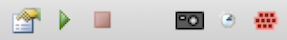

Phase Plate Aligner Handles counting of images used on the patch and advance to the next position if needed. It also charge (i.e. expose) the new patch for a given time both at normal and beam tilted condition to give good contrast when the imaging and beam-tilt based focusing takes place later. These operations are performed at the reference target position and using the last preset in the node that sends the triggering event. The counting is achieved by receiving an AcquisitionImagePublish Event that marks the completion of an image acquisition.

## Bindings

**Required Binding for checking the count and advance patch position**

Acquisition -> PhasePlatePublishEvent -> Phase Plate Aligner

**Required Binding for registering an on-plane image is taken with current patch**

Acquisition -> AcquisitionImagePublishEvent -> Phase Plate Aligner

**Required Binding for moving to reference target**

Phase Plate Aligner ~~[ChangePresetEvent]{style="text-align:right;"}~~> Presets Manager
Presets Manger -> PresetChangedEvent -> Phase Plate Aligner
Phase Plate Aligner -> MoveToTargetEvent -> Navigator
Navigator -> MoveToTargetDoneEvent -> Phase Plate Aligner

*Optional: If GIF is present, Align zero loss peak is most efficiently combined with the patch position advancement and being done before that. You may add this binding to achieve that. Note that this will not check if it needs alignment, just execute the alignment sequence itself.

Phase Plate Aligner -> FixAlignment -> Align Zero Loss Peak

## Phase Plate Aligner Tool Bar

From left to right:

### Settings

Required setting change before usage:

- Deactivate "Bypass Conditioner" to activate this node to respond to request.
- Enter current phase plate slot (1-6) and Current Phase Patch Position, and click "Update" to record it.

### Run Test

It goes through all the steps that it does involving moving to the next phase plate patch position.

1. Enter current phase plate slot and patch position in the settings.
2. Make sure your have a valid reference target in this session, or manually move the stage to an open area.
3. Send the on-plane condition preset you want to run the position advance test to scope with Presets Manager.
4. Left click this tool

### Stop Test

This does nothing now.

### Acquire and Save Current Position as Reference

It saves an image as parent image with its center as reference target. It makes it easier to choose reference at higher magnification and allow navigator iterated move to be applied.

1. Move manually to the position that you would like to use.
2. Send a medium mag preset (such as sq or hl) that is centered at this position.
3. Left click this tool.

### Reset Counter

Reset counting without moving to the next patch.

### Patch State Mapping

Some area of the phase plate slot may not be usable. This allows them to be skipped during automated advancing.

1. Enter the phase plate slot number you would like to map as current phase plate slot in the settings.
2. Left clieck this tool.
3. Choose and set to "checked" each position you would like to skip.
4. **Important** Due to a gui bug, make sure you choose a position other than your last that you have changed state before clicking "OK" and exit the dialog.

