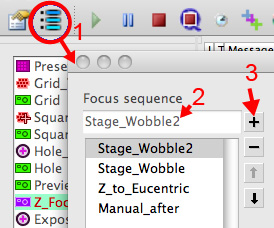
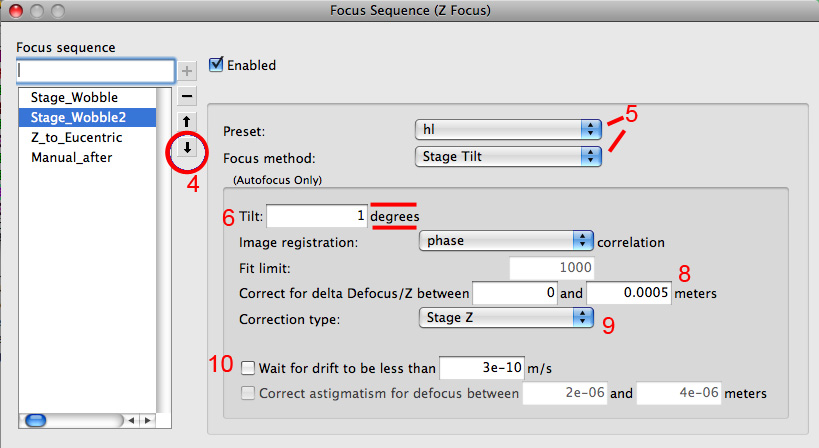

You may have a grid that requires additional focusing step at either Z_Focus or Focus node that is not available to be activate in Leginon by default. In this case, a new step can be added using this instruction:

1.  open the Focus Sequence dialog.
2.  type the name of the new step in the box below the heading "Focus sequence"
3.  click on the "+" tool to add to the sequence. This is most likely show up not as the first step.
    
4.  click on the arrows to move the new step to where you want while it is highlighted.
5.  select the preset and method to measure the defocus.
6.  enter the angle you want to use to induce image shift for focus measurement. Note that the unit changes according to the focus method. For example, the default 0.01 is not going to be very useful if you are tilting the stage since it is in degrees.
7.  you might want to change fit limit if the focus limit is "Beam Tilt".
8.  Give a upper limit you will allow a correction to be made. This prevents images that has no feature to initiate an unreasonable correction.
9.  Correction type depends on the purpose. It is not recommended to use "Defocus" correction type in Z_Focus node since it is meant to do rough focusing that move the specimen to eucentric height.
10. There should only be one activated Wait for drift per node and is usually only used for fine adjustment in Focus node.
    
11. click O.K. and save the sequence.

[< Optimizing Autofocus](/leginon/Leginon_Manual/Multi-Scale_Imaging_Applications_in_General/Optimizing_Autofocus) | [Queuing option >](/leginon/Leginon_Manual/Multi-Scale_Imaging_Applications_in_General/Queuing_option)
