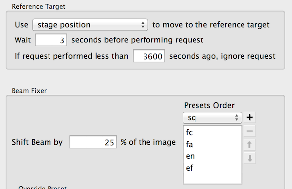

There are several ways to fix beam shift during data collection. They are described here. If the environment is stable, beam shift should become stable once automated data collection becomes routine. If it is a problem suddenly, you are advised to check if there is anything wrong with the scope or the environment such as temperature control failure since just fixing the beam shift is not going to solve the real problem.

## Manual intervention and operate the scope directly

## Manual intervention using Presets Manager *Shift Beam for a Preset" tool.

**[Beam Shift matrix calibration](/leginon/Leginon_Manual/Leginon_Calibrations_Application/Beam_Shift_matrix_calibration) at the preset this is done is required**. If the camera is not high dose sensitive, such calibration at a reduced magnification 1/5 x could also be used so that the whole beam can be viewed in the image acquired during the tool operation.

1.  Pause Leginon and make sure the scope is not being used.
2.  Select the preset at the magnification that require alignment in Presets Manager
3.  Click on the tool icon  to open the dialog window.
4.  At the bottom it should show the applicable magnification that you have beam shift matrix calibration.
5.  Click Acquire button to acquire an image. The preset will be sent to microscope and image taken according to the preset but at smaller format as defined in presets manager settings.
6.  Activate the selection tool  at the image panel and click at the center of the beam. Then new beam shift will be saved automatically for all presets at the same magnification.
7.  Repeat the last step if needed.
8.  Close the dialog by clicking "OK" button.

## Automated beam shift adjustment with "Fix Beam" node.

Fix Beam node uses [BeamFixer](/leginon/Leginon_Manual/Node_Descriptions/BeamFixer) class to adjust the beam shift at set time interval.

1.  To use this, a reference target needs to be assigned on the grid at the grid square position where it is empty. Reference targets can be selected in "Square Targeting" node, and "Tomography Targeting" node, for example.
2.  Open the advanced settings dialogue for "Exposure" node to activate "Publish and wait for the reference target" so that the beam will be fixed before the final exposure and focusing.
3.  Open the settings dialogue and set the settings according to this figure and instruction below.
    
    1.  The reference target portion of the settings determines how often the "Fix Beam" node will attempt to adjust the beam shift. It will use "stage postion" mover to reach reference target selected when it is activated.
    2.  The first preset (fc in this case) in **presets order** is used to setup the scope condition when images are taken. The other presets listed in Presets Order are the ones which beam shift will be adjusted when fix beam finds a better value.
    3.  The beam will be shifted in a 3x3 matrix by a distance calculated from the preset and the percentage shift, centered at the current preset position. The algorithm evaluate the mean intensity of the images acquired and finally shifts the beam to the position where the intensity is the highest and save the new beam shift to all presets listed.
    4.  Overwrite Preset part is relevent if the chosen preset is not optimal for acquiring these images. Do not activate overwrite preset unless needed.
4.  Close the settings dialog.

Testing:

1.  Send the preset that will be used from presets manager to scope. You may purposely shift the beam off in this preset.
2.  Click  in the toolbar.
3.  Check if the beam adjustment is reasonable.
