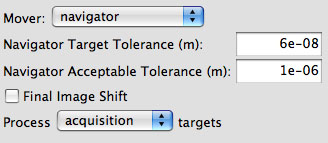
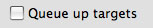

Since we have observed that, at least on FEI computage, the targeting accuracy is higher when the distance of movement is smaller, a special option is put in regarding how a target is moved to the center for imaging at the next scale. This method of movement is currently used in MSI-RCT, MSI-RCT raster, and MSI-Tomography applications at the final exposure step.

**IMPORTANT: When using this option before a Targeting Node with queuing and the next Acquisition Node moves to the target by image shift or image beam shift, the image shift applied may be excessive since the stage can not reach the destination during Target Adjustment. Activate "Use Ancestor Image Mover for Adjustment" in the next Acquisition Node.**
For example, "Hole" Node is set to use navigation iterative stage movement, the queuing is active in "Exposure Targeting" Node, and "Exposure" uses image shift. Then it is advisable to activate "Use Ancestor Image Mover for Adjustment" in "Exposure" Node.

**IMPORTANT: Because this process need to reacquire the parent image at each iteration, the electron dose in the area WILL accumulate. Make sure the dose used for the parent image preset is minimal and DO NOT use an "Naviation Target Tolerance" that takes 10 or more iterations to achieve.**

## What does it do?

When a target on the parent image needs to be centered for the acquisition an iterative process is performed.

1.  The target position relative to the center of the detector (i.e., center of the parent image) is calculated.
2.  An attempt is made to bring the target to the center of the detector using the calibration available to it and the position of the target on the parent image.
3.  An image is acquired using the parent preset. The reacquired image is compared with the original image in the region of the targeting area to determine if the stage movement has brought the target to the center of the detector. The movement error is the position of the intended target relative to the center of the detector.
4.  If the movement error is larger than the "Navigator Target Tolerance" settings, the process is repeated using the reacquired image as the new parent image and the adjusted target on the new parent image.
5.  In the case that the movement error becomes larger than the previous iteration, a decision is made on whether the targeting is considered successful so that images will be acquired in the node or the targeting is considered as failed so that it moves on to the next target. The decision is determined by whether the final movement error is smaller than "Nagigator Acceptable Tolerance" settings.

## Related Settings

In Acquisition Node Class, such as Square, Hole, Exposure

1.  Move type: Must use either stage position or modeled stage position
2.  Mover: Navigator
3.  Navigator Target Tolerance: Enter a positive number that is the target for the iterative movement. The iterative movement is not performed if this value is zero. A typical value is the limit of your goniometer movement accuracy at minimal movement. For example, on our F20 and well-tuned goniometer, this is typical set to 6e-8 m.
4.  Navigator Acceptable Tolerance: The cut-off for accepting an increased movement error as successful target centering.
5.  Final Image Shift: Compensate the final movement error with an image shift. Currently does not work on RCT node.

In Targeting Node used to select targets on images acquired by the above node. This means "Hole Targeting" node if iterative move is activated in "Square", and "Exposure Targeting" node if activated in "Hole".

1.  Queue up Targets: Usaully off for efficiency.
    
2.  If on, the next Acquisition node must "Use Ancestor Image Mover for Adjustment" if using "image shift" or "image beam shift" to move. This is so that target adjustment will iterate the movement.

## How to [Determine Target Tolerance and Acceptable Tolerance](/leginon/Leginon_Manual/Multi-Scale_Imaging_Applications_in_General/Iterative_Stage_Movement/Determine_Target_Tolerance_and_Acceptable_Tolerance) 

[< Monitor Progress of Queued Targets](/leginon/Leginon_Manual/Multi-Scale_Imaging_Applications_in_General/Monitor_Progress_of_Queued_Targets)
