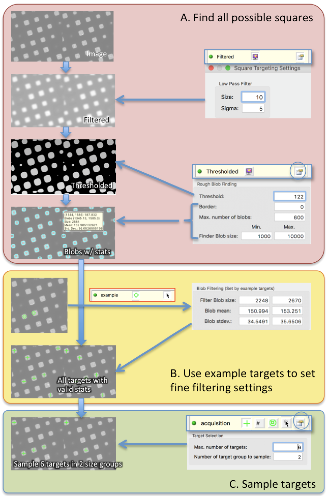

Square Finder is a blob finder and then filtered by blob stats such as size, mean and stand deviation from the mean values in the blob.

Step A is to find all possible square with a generous settings. These settings should be fairly stable if the same scope/camera pair, magnification is used. Make sure Finder Blob size covers a wide range of square opening.

Step B involves the user selecting a few example targets that would cover the range of blob stats we want it to keep.

Step C samples the valid targets. If you want the targets to evenly distributed in the stats size range chosen by the exemplars, Use multiple target group. For example, if you choose 2 groups, it sorts all targets and then separate the smaller half and larger half. The random sampling only applies to within the group.

**The example targets will always be included in the final sampled targets unless some targets are already chosen in that blob previously.**

**The square containing targets already being submitted for processing are not included in the final result.**

