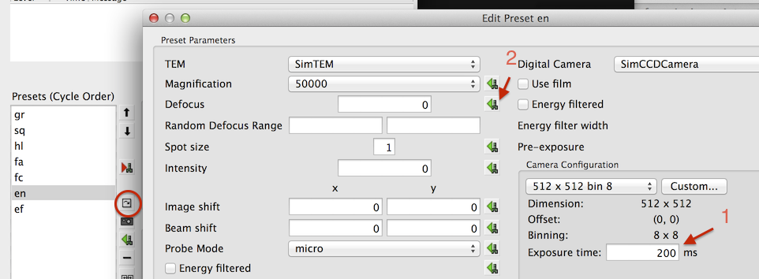
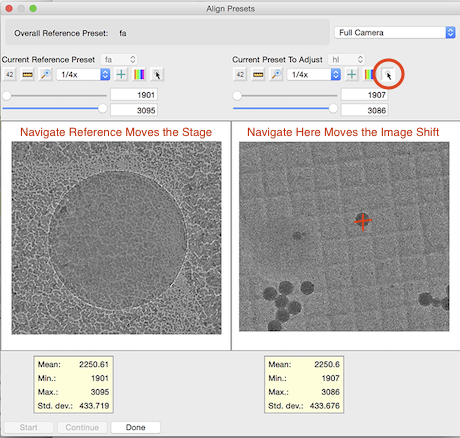

This section shows some of the more important and complicated steps in the set-up checklist. It assumes that the user knows the nomenclatures. See the full documentation if you want the detailed explanation. It also assumes that general set-up and calibrations exist from previous sessions so that most calibrations can remain unchanged. The steps that are NRAMM specific are marked. MSI now features stage Eucentric height correction at each square.

NOTE: The Tietz imaging software (EMMenu) must be turned OFF before Leginon is started. In contrast to this, the Gatan imaging software (Digital Micrograph) must be ON before Leginon is started.

## Starting Up

Set up is most stable with a good microscope alignment.

1. Initial alignment at the microscope See Chapter on [Microscope setup](/leginon/Microscope_Set-up) for details.

* scope> Insert specimen holder
* scope> Put stage to eucenter and reset defocus in both HM mode AND LM mode
* scope> Check gun tilt and shift
* scope> Check rotation center and beam tilt pivot points in the HM mode
* scope> Save the goniomenter position for the square with intact supporting film where the alignment was done and do the same for a square where the supporting film is broken (where bright/dark images can be acquired).

2. Start python-based leginon main program amd leginon
client. See Chapter on [Start Leginon](/leginon/Microscope_Set-up).

* scope> Set up [CCD camera](/leginon/Leginon_Manual/Multi-Scale_Imaging_Applications_in_General/MSI_set_up_in_more_details#Starting-Up)
* [scope> Start Leginon Client](/leginon/Run_Leginon_Client_on_the_Microscope_Computer)
* scope> If the following error message appears, DO NOT touch it, or Leginon Client will need restarting

> *"Exception EAccessViolation in module adaExp.exe at....*
> *Access violation at address xxxx in module 'adaExp.exe'. Read of address xxxx"*

* [main> start-leginon.py](/leginon/Leginon_Manual/Start_Leginon/Start_Leginon_at_your_main_working_station_remotely)
* Leginon Setup Wizard> Create new or Select old session, connect to the instrument host, and start.

3. Start your preferred "MSI" application.

* Leginon/Application/Run> Select the "MSI" application you would like to use (Edge,T,Raster, or Tomography), the scope, and the main launcher. Click Run.

## Import existing presets

* Leginon/Node Selector> Select "Presets Manager" node.
* Leginon/Presets Manager/Preset Selector> Import presets from a previous working session 
Select the TEM and camera to "Find" sessions closest to the condition of your data collection.
Use shift-key to select a series of presets if needed. Hold-down to ctrl-key allows individual selection/deselection.
Click "Import" button to import, the presets should appear in the Presets Manager/Preset Selector window.
Click "OK" to exit "Import Presets" window.
Note: Creating new preset and adjusting the preset are covered in Calibration Chapter under [Creating presets the first time](/leginon/Leginon_Manual/Leginon_Calibrations_Application/Creating_Presets_for_the_first_time).
* The cycle order should match the sequence of data acquisition to minimize hysteresis. If the presets are imported from previous session, the cycle order is imported automatically. As an example, the cycle for naming scheme used here at NRAMM is gr -> sq -> hl -> fa -> fc -> en -> ef.
* Leginon/Presets Manager> Select a preset in the list box and then click "To Scope"  to apply the settings to the scope and synchronize Leginon and the scope settings.

## Save the alignment and empty position in Leginon

* scope> Recall the stored intact or empty position or go to such
location.

* Leginon/Navigation/Toolbar/Stage Locations>  Enter a New name to store Stage Location such as, for example, "empty" and "align", respectively. Save the xy coordinate only.

## Retrieve the stored alignment or empty position in Leginon

* Leginon/Navigation/Toolbar/Stage Locations>  To recall the position, select the named location under the same tool and click on "send to scope".

## Reset defocus to zero at eucentric focus in LM mode

1. Leginon/Presets Manager> Send the sq preset at LM mode by choosing the preset name and click the "To Scope" tool on the right of the preset selection box.

2. scope> Move the grid to a position on the "align" square,

3. scope> Use stage alpha wobbler to move the sample to eucentric height if hasn't done so.

4. scope> Focus the beam to see only a small area of the intact square. Turn the focus knob to find the point where a scattering halo goes through the minimum which indicates that it is at focus. This procedure finds the focus easier than looking for minimal contrast in LM mode.

5. scope> Reset defocus to zero.

## Reset defocus to zero at eucentric focus in HM mode

**This is different from the original manual so that the microscope alignment follows will be done at the eucentric height according to the fixed, small tilt of Leginon wobbling used in Z Focus node in operation**
1. Cycle thru presets with microscope main screen down so that you can see them change. Align beam shift roughly so that the beam can cover the digital camera when you sent "sq","hl" and "fc" preset to scope.

2 Use "Z Focus" node and simulate target tool to set the eucentric height of the grid using only stage tilts.

This means that you only activate focus sequences that uses "Stage Wobble" as method of defocus determination. We recommend this combination:
|sequence name (arbitrary)|preset|tilt amount|correction method|
|1st Stage Wobble|sq|1 or 2 degrees|stage z|
|2nd Stage Wobble|hl|same tilt as in the first sequence|stage z|

3. [Use manual focus tool](/leginon/Manual_Focusing_Tool) to bring focus to guassian focus and save the lens current that achieves this as the eucentric focus.

## Condenser aperture 2 switching for gr preset

The larger C2 aperture may be needed by "gr" preset to cover the camera. The following minimize the work for the switching
1. Send "hl" preset to scope, shift the beam to the center of the main screen if needed.
2. Switch the condenser aperture 2 to the larger size.
3. Center the illuminated area by adjusting the condenser aperture position (**NOT with BEAM SHIFT KNOB**). There is no need to adjust it finely. It is also a bad idea to adjust beam shift or beam diameter of the higher mag presets according to the larger aperture.

## Grid preset image shift refinement

1. Leginon/Presets Manager> Send a preset at an intermediate mag at HM mode as the reference (e.g. hl) "To Scope" 

Note: sq preset in LM mode can be used if the image alignment between LM and HM
is known to be good.

2. scope> Move the grid to a position on the "align" square, either on a recognizable object or burn a good hole through ice at the center of the CCD as preparation for lower mag preset image shift correction.

3. Leginon/Presets Manager> Click on the tool "Align presets to each other" .

4. Check, adjust, and save the preset(s) to be aligned.

The left panel displays and navigate by "Stage Position" of the reference preset while the right panel displays and navigate by "Image Shift" of the preset to be aligned
* Leginon/Presets Manager/Align Presets> Choose the reference (hl) preset on the left panel.

* Leginon/Presets Manager/Align Presets> Choose the aligning (gr) preset on the right panel.

* Leginon/Presets Manager/Align Presets> Select "Similar look across mags" mode at the top left corner of the window. This will use a smaller part of the CCD to acquire the image for the lower mag preset so that it appears to be magnified in the 512x512 image panel.

* Leginon/Presets Manager/Align Presets> "Start" image acquisition.

* Leginon/Presets Manager/Align Presets> If the recognizable object can not be found in both panels, go back to step one to choose a lower mag preset or a better object.

* Leginon/Presets Manager/Align Presets> If the recognizable object can be found in both panels but not at the center on the reference left panel, navigate* it to the center using its "Click Tool". Wait for the move to complete and both images refreshed.

* Leginon/Presets Manager/Align Presets> Navigate* the object on the right panel to the center using its "Click Tool".The new image shift is automatically saved at each move.

* Repeat 7 if necessary.

Note: "Navigate" means selecting the navigate tool  on the top right of image display and then double clicking the location of the new center that is translated by the given TEM Parameter.

## Grid preset stage position refinement

Stage position model Scale and Rotation is stable as long as the LM eucentric height defocus is set to zero before each session, although variation from day to day is normal. Check the stage movement calibration of gr preset by navigating it in Navigation node. Within 10% error is satisfactory since reaching a square does not require high accuracy. If not, perform stage model position *[scale and rotation calibration](/leginon/Leginon_Manual/Leginon_Calibrations_Application/Modeled_Stage_Position_calibration#Magnification-and-image-rotation-adjustment-of-the-model)> at gr preset* using "Calibration" application as following:

*[Why goniometer model is better](/leginon/Leginon_Manual/Leginon_Calibrations_Application/Modeled_Stage_Position_calibration).*

1. scope> Remove the objective aperture.

2. Leginon> Run "Calibrations" Application

3. Leginon/Presets Manager> Send "gr" preset to scope.

4. Leginon/GonioModeling/Settings/Measurement> Set axis=x, Points=5,Tolerance=25%, and Interval=1e-05 m. Default model label is the session name.

5. Leginon/GonioModeling/Settings/Modeling> Set "Scale and Rotation Adjustment Only"=Yes. Other settings will be set automatically once measurements are finished.

6. Leginon/GonioModeling> Click on  will start "Measure" the shifts of between points that are moved on x axis of the goniometer.

7. Leginon/GonioModeling> Click on  will "Calibrate" the scale and rotation of the model on x axis of the goniometer.

8. Leginon/GonioModeling> repeat 4-7 with the axis set to y.

## Acquire mosaic atlas of the grid

1. scope> Remove the objective apperture.

2. Leginon/Grid Targeting> Click "Settings" to check the preset used, the size and name of the atlas.

3. Leginon/Grid Targeting> Click "Calculate Atlas" 

4. Leginon/Grid Targeting> Click "Submit Targets"  to begin acquiring the atlas.

5. Leginon/Square Targeting> Follow the atlas progress in the display. (*There is no sign at the end currently other than that nothing happens for a long time and that the atlas dimension is the same in other direction when it is completed.)

6. scope> Insert the objective aperture.

7. Leginon/Presets Manager/Send an HM preset "To Scope" several times to cycle all magnifications and warm up the objective lens to minimize the image shift hysteresis in switching between LM and HM modes. Only if the scope has been in LM mode for a long time, wait for at least 30 min before final image shift refinement of needed LM preset during acquisition (i.e. sq)

8. scope> Switch condenser aperture 2 back to that used for higher mag data collection. Refine the aperture position finely at the final exposure preset.

## Determine the proper exposure condition for exposure presets for non-frame exposure limited camera

Exposure presets are the base presets for data collection. To keep it to low dose condition such as 10 electron/Angstrum, measurement of dose is performed and the exposure time is adjusted. If scope or camera parameters are changed during the session, the dose value is no longer valid and should be remeasured.

1. Leginon/Navigation/Toolbar/Stage Locations  Send the "empty" position "To scope".

2. Leginon/Presets Manager/Preset Selector> Select a high mag exposure (i.e. "en" or "ef"), confirm that the parameters are what you desire for the experiment, and then send "To Scope" .

3. scope> Expand the beam to at least cover the CCD (> medium circle mark on the viewing screen) and to the size you desire.

4. Leginon/Presets Manager/Preset Selector> If you have changed the size or location of the beam or other preset scope parameters at the scope, you must retrieve
the preset parameter "From scope"  first before checking and saving the dose value.

5. Leginon/Presets Manager/Preset Selector> "Acquire dose image"  for the selected preset.

6. Leginon/Presets Manager/Dose Image> Check the "Dose" value.

7. Leginon/Presets Manager/Dose Image> If desired dose is known, fill in the value and then click "Match". This will change exposure time to give a close match of
the value entered.

8. Leginon/Presets Manager/Dose Image> If not satisfied with the value, click "No", change the exposure time by editing the preset, and try again (No need to send
the preset "To scope" again for the repeat)

9. If the scope can not give such illumination to satisfy dose, exposure time and area requirement, alignment is required or change of gun lens or spot size is needed.

10. Leginon/Presets Manager> Copy the preset parameter to the other exposure preset.

* Preset Selector> send the preset that has the dose measurement "To Scope" 
* Preset Selector> select the preset to receive the copy
* Preset Selector> retrieve the parameters "From Scope"  for the selected preset.
* Preset Selector/Edit>  Modify defocus for the preset after the retrieval.

## Edit preset parameters individually for a selected preset

* Preset Selector> Access this function by clicking  (circled in the image below)
* Preset Selector/Edit> You can change values directly. For example, the exposure time of the camera as pointed by **arrow 1**
* Preset Selector/Edit> You can also import a particular parameter from the current scope value. For example, you may set the defocus you want at the microscope, and then import it by clicking  next to the defocus parameter as shown by **arrow 2**

## Adjusting the beam diameter of the presets for DD camera by its dose limit per frame exposure

1. Leginon/Navigation/Toolbar/Stage Locations  Send the "empty" position "To scope".

2. Leginon/Presets Manager/Preset Selector> Select a high mag exposure (i.e. "ed"), confirm that the parameters are what you desire for the experiment, and then send "To Scope" .

3. Leginon/Presets Manager/Preset Selector> "Acquire dose image"  for the selected preset.

4. Leginon/Presets Manager/Dose Image> Check the "Dose" value per pixel per frame.

5. Leginon/Presets Manager/Dose Image> If not satisfied with the value, click "No", change the beam diameter of the preset, save it from scope, and try 3 and 4 again. Alternatively, exposure meter values of the small screen of the tem can be used to estimate the dose rate of the beam on the camera.

6. Leginon/Presets Manager> Copy the preset parameter to the other exposure preset.

## Update bright and dark correction images for exposure presets

Exposure presets are the base presets for data collection. To make sure the best correction is applied to them, the correction images should be acquired prior to the experiment at session. Since no correlation is normally done on these images, only one [channel](/leginon/Leginon_Manual/Leginon_Calibrations_Application/Bright_and_Dark_reference_images#Correction-Channels) is needed. Normalization image might need to be [Bright and Dark reference images#Correction-Planmodified](/leginon/Leginon_Manual/Leginon_Calibrations_Application/Bright_and_Dark_reference_images#Correction-Planmodified) if a large chunk of region is blocked by a fallen debris.

1. Leginon/Presets Manager> Select a dose measured high mag exposure (i.e. "en" or "ef"), and then send "To Scope".

2. Leginon/Correction/Settings>

* Select TEM and camera to match that will be used.

* Camera Configuration: The exposure preset camera configuration

3. Leginon/Correction/Settings> Click OK to exit settings.

4. Leginon/Correction/Toolbar> Select "Raw image " from the pull down list of acquisition modes and then click on "Acquire" button next to the selector to view an image that is not corrected.

5. Leginon/Correction/Toolbar> Select "Dark reference" in the acquisition mode selector and then click "Acquire" to acquire the Dark reference image for this particular camera configuration.

6. Leginon/Correction/Toolbar> Select "Bright reference" and repeat the acquisition to obtain the Bright reference.

7. Leginon/Correction/Toolbar> Select "Corrected image" and then "Acquire" to view the corrected image. A corrected image should be free of artifacts and have
smaller standard deviation than the raw image, in general.

8. Leginon/Correction/Toolbar> If there are regions consistently over normalizes the acquired image, either select the region and use the "+" tool to "Add Region to Bad Pixel List", or click on  to "Add Extreme Points to Bad Pixel List" one of more times to find the outliers. Right click on a shown bad pixel removes it from the list.

## Medium mag preset image shift alignment

Preset image shift alignment can be done follow the same procedure as the section "[Grid preset image shift refinement](/leginon/Leginon_Manual/Multi-Scale_Imaging_Applications_in_General/MSI_set_up_in_more_details#Grid-preset-image-shift-refinement)" but is more efficient using the automated mode as follows.

1. Leginon/Presets Manager> Send one of the exposure or same/similar mag autofocus preset as the reference (e.g. en) "To Scope" 

2. scope> Move the grid to a position on the "align" square, either on a recognizable object or burn a good hole through ice at the center of the CCD as preparation for lower mag preset image shift correction.

3. Leginon/Presets Manager> Click on the tool "Align presets to each other" . The tool automatically select the reference preset that was selected in the Presets Manager mainpanel and choose a preset at closest magnification as the starting aligning preset.

4. Leginon/Presets Manager/Align Presets> Click "Start" to acquire the first image pair.

5. Check, adjust, and save the preset(s) to be aligned.

The left panel displays and navigate by "Stage Position" of the reference preset while the right panel displays and navigate by "Image Shift" of the preset to be aligned

* Leginon/Presets Manager/Align Presets> Changing Selection of "Similar look across mags" or "Full CCD" mode at the top left corner of the window will cause reacquisition of the image pair in the automated mode.

* Leginon/Presets Manager/Align Presets> If the recognizable object can be found in both panels but not at the center on the reference left panel, navigate* it to the center using its "Click Tool". Wait for the move to complete and both images refreshed.

* Leginon/Presets Manager/Align Presets> Navigate* the object on the right panel to the center using its "Click Tool". The new image shift is automatically saved after each move.

* Repeat if necessary.

* Leginon/Presets Manager/Align Presets> Click "Continue" to save the alignment to all presets of the same magnification and continue to the next preset pair.

6. Repeat the process if desired.

## Go to MSI Operation section

The setup that requires you to be next to the microscope is completed. Go to the section on [MSI Operation](/leginon/Leginon_Manual/Multi-Scale_Imaging_Applications_in_General/MSI_Operation) You can come back and continue on this section after you have learned how to go through the operation without automated hole finding.

## Hole Targeting Set-up

We can use any image that is already loaded into Hole Targeting to adjust these parameters. The values in this node vary so much from grid to grid that the best way to find these parameters is by going through a step-by-step trial-and-error process. To see the final acquisition and focus targets, enable only the Original, acquisition, and focus display selections. Refer to Introduction Chapter on [how the various tools behave in the control panel](/leginon/MSI_set-up_in_more_details).

The loaded image normally comes from the image acquired through "Square" node when you submit targets on the grid atlas in "Square Targeting" node. You can also do a practice run using the default image comes with Leginon. To load the default image, leave the filename entry blank when you click "Load" in the hole finding settings window for the step "Original". The default values in the node gives an example of reasonable target finding with such a default image.

Setting up Hole Targeting Depends on which MSI flavor you are running:

1. [MSI-Edge](/leginon/Leginon_Manual/Leginon_MSI-Edge_Application/Hole_Targeting_Set-up_for_MSI-Edge) uses template matching of the edge image

2. [MSI-T](/leginon/Leginon_Manual/Leginon_MSI-T_Application/Hole_Targeting_Set-up_for_MSI-T) uses template matching of the original image

3. [MSI-Raster](/leginon/Leginon_Manual/Leginon_MSI-raster_Application/Raster_finder_nodes_set-up) creates raster points from a given origin

4. [MSI-Tomography](/leginon/Leginon_Manual/Preferences_Setup/Initial_MSI_application_preference_setup#Settings-that-are-the-same-as-in-other-MSI-applications-in-queuing-mode) does not use automatic target finding. Therefore, it does not requires set up.

## Exposure Targeting Set-up

Like hole targeting, we can use any image that is already loaded into Exposure Targeting to adjust these parameters. There is also a different default image came with Leginon for your practice.

Setting up Exposure Targeting Depends on which MSI flavor you are running.

1. [MSI-Edge](/leginon/Leginon_Manual/Leginon_MSI-Edge_Application/Hole_Targeting_Set-up_for_MSI-Edge) uses template matching of the edge image

2. [MSI-T](/leginon/Leginon_Manual/Leginon_MSI-T_Application/Hole_Targeting_Set-up_for_MSI-T) uses template matching of the original image

3. [MSI-Raster](/leginon/Leginon_Manual/Leginon_MSI-raster_Application/Raster_finder_nodes_set-up) creates raster points from a given origin

4. [MSI-Tomography](/leginon/Leginon_Manual/Preferences_Setup/Initial_MSI_application_preference_setup#Settings-that-are-the-same-as-in-other-MSI-applications-in-queuing-mode) does not use automatic target finding. Therefore, it does not requires set up.

## Autofocus Test

There are two focusers in MSI. "Z Focus" node usually moves stage in Z direction to Eucentric height at lower mags. "Focus" node usually just correct the defocus in the way equivalent to turning the focus adjustment knob on the scope at a higher mag. The defocus measurements in both nodes are based on the same principle of beam-tilt induced image shift. A correlation (normally phase) is used to obtain the image shift. Therefore, it is important to test and preform autofocus measurement at area with recognizable feature that does not move significantly during the defocus measurement.

The test use "Manual_after" focus step in the focus sequence for checking. Two procedures can be used to reach a area for good correlation measurements:

1. Using Simulate Target tool

* Leginon/Presets Manager> Send the autofocus preset "To Scope"

* scope> Move to an area that has recognizable feature on the carbon support at the center.

* Leginon/(Z) Focus/Focus Sequence  > Enable desired autofocus and "Manual_after" focus steps.

* Leginon/(Z) Focus/Toolbar> Click Simulate Target  and follow the autofocus

2. Submitting focus target from Hole Targeting

Note: To use this procedure, there has to be a grid mosaic, and the Hole Targeting should allow user verification of targets

* Leginon/(Z) Focus/Focus Sequence  > Enable desired autofocus and "Manual_after" focus steps.

* Leginon/Square Targeting> Select a test square and submit it 

* Leginon/Hole Targeting> Submit a focus target to test autofocus in Z Focus node and an acquisition target for the next stage. Both targets should be in an area that has recognizable feature with carbon support.

* Leginon/Z focus> follow the autofocus test in this node.

* Leginon/Exposure Targeting> Submit a focus target at a location that has recognizable feature with carbon support to test autofocus in Focus node.

* Leginon/Focus> follow autofocus test in this node.

Check the performance of autofocus by the following criteria:

1. During autofocusing:

* Display the image and correlation peak: The observed movement of images upon beam tilt should be consistent with the correlation peak and the edge of the beam should not be visible in any of the beam-tilt images.

* Display the correlation image: The correlation peak at its correct position should be significantly higher than background.

2. During manual focusing

Manual Focusing can be activated either by enabling "Manual_before/Manual_after" steps or directly when leginon is idle using (Z) Focus/Toolbar/MF.

- Manual_before/Manual_after focus sequence:
- The preset used is set inside focus sequence settings 
- Manual Focus Tool 
- When using Manual Focus Tool directly, the preset is set by the preset named "manual focus tool preset" found also in focuser node settings.

* MF> The FFT should show visible and isotropic Thon ring according to the fc preset defocus.

* MF/Toolbar> Make sure the move type is "Defocus" and the set value in the box is 0 m then click "Set instrument" botton . This will set the defocus to the current 0.

* MF> The perfect autofocus result is that the FFT indicates that the scope is at Gaussian focus.

* For relative movement, press "+" or "-". The step size is determined in MF/Toolbar/Settings> You can also left-click on the first node of the power spectrum displayed to change the step size.

* To reset defocus to zero at the new focus, press the so-named button .

* Clicking the Stop button  exits the manual check.

[< MSI Quick-start](/leginon/Leginon_Manual/Multi-Scale_Imaging_Applications_in_General/MSI_Quick-start) | [Special Operation setup >](/leginon/Leginon_Manual/Multi-Scale_Imaging_Applications_in_General/Special_Operation_setup)
