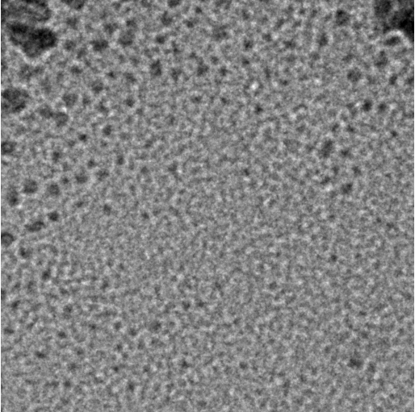
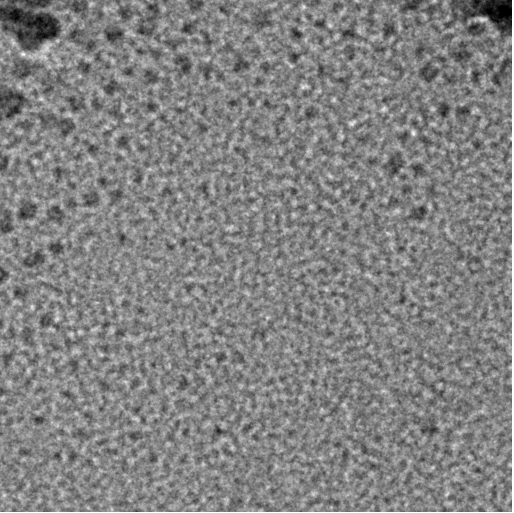
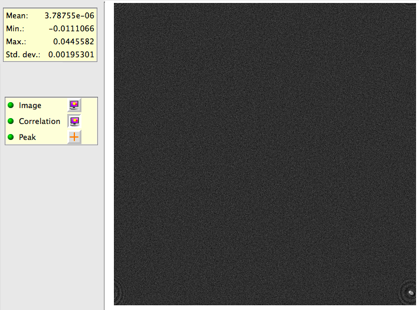

Focus, Z Focus, tomo Focus and other variation of focus nodes use the same Focus class but with different settings, focus sequence and position in the MSI sequence to achieve different effects. Each need to be optimized for your instrument and usage. The defaults we provide works for us but an understanding of how it works can help you having the smoothest run and getting the best data.

  ------------ ---------------------- --------------------------------------------------------------------------------------------------------------- ------------------------------------------------------------------------------------------
  Node Name    Found in Application   Prerequisite                                                                                                    Performance Target
  Z Focus      all MSI                visible area on the grid                                                                                        grid almost at eucentric height, defocus zero is no more than what Focus node can handle
  Focus        most MSI               grid almost at eucentric height to allow using only defocus to make correction without significant beam shift   defocus zero is reset to within acceptable tolerance for final exposure
  Tomo Focus   MSI-Tomography         grid close to eucentric height, defocus zero is at eucentric height                                             grid is accurately set at eucentric height
  ------------ ---------------------- --------------------------------------------------------------------------------------------------------------- ------------------------------------------------------------------------------------------

## What you should see during autofocus by beam tilt:

Here is an 512x512 example image pair acquired in Focus node at 0.14 nm/pixel at beam tilt separated by 0.8 mrad and --300 nm defocus:
|| |
|focus1 image|focus2 image|

At Focus node of your MSI application, you can watch their display. Make sure that the beam has not shifted off the view (an indication of bad Beam Tilt Pivot Point Alignment) and the contrast does not reverse (Objective aperture not centered or too small for the beam tilt applied).

In the same node, you can make it display the correlation by selecting the display panel on the left of the image like this:

The correlation map shown in Leginon has origin (identical image correlation) at top left corner and is wrapped around so that peaks close to all corners means smaller shift than peaks close to the center of the correlation map. In this example, phase correlation is used, and focus2 is shifted from focus1 to the top-left by a distance of about 1/15 of the image. Therefore, we see a peak at bottom-right. and the phase correlation peak is sharp with flat background.

You may notice that the peak is elongated and have modulation around it. This is caused by the coma effect of the beam tilt. The coma effect changes the apparent defocus and astigmation so that the two images are not related only by a shift.

If you turn on also the Peak display, you can determine if the peak finding has correctly identify the maximal peak of the correlation map.

## Optimizing the parameters for beam-tilt based defocus measurement:

In general, larger beam tilt and smaller pixel size give better accuracy of defocus measurement, and therefore autofocusing result. However, beam tilt coma-effect and the limitation of the objective aperture size, and the stability of the beam shift during the beam tilt process often determines the limit toward this end. On the other end, smaller beam tilt and larger imaging area both in number of pixels and in physical units give larger range of measurable defocus, and hence the range the correction can be made reliably.

For example, if you require an eucentric defocus accuracy of 0.1 micron while being able to handle an starting error of 500 micron. This is unlikely to be achieved in one focus sequence step.

Displacement of image, *d*, at defocus *z* as induced by a beam tilt of *a* is given approximately,

d = Cs * a^3 + z * a

where Cs is the spherical aberration constant. Two different defocus z1 and z2 would therefore see a difference in d as

d1-d2 = (z1-z2) * a

To tell a difference, the pixel size of the image need to be smaller than the displacement (d1-d2). Let's say that the beam tilt is limited by the objective aperture to have a maximal value of 0.01 radian, this means the pixel size to reach the autofocusing accuracy of 0.1 um will be 1 nm. A reliable image shift measurement is limited by other coma-effect and is in about 1/4 of the image from our experience. Therefore, the range of defocus it can handle is 1000 x 0.1 micron = 100 micron if 4kx4k image is used. Unfortunately, image processing of 4kx4k image is too slow still, so you are likely use 1kx1k with binned pixel to be 1 nm. As a result, the range of defocus this can handle is now 250 x 0.1 micron = 25 micron.

An additional consideration is the stability of the optics. If you use only the defocus correction to correct for 300 micron error, the scope alignment is unlikely stay optimal which is why Z Focus node pirmarily does adjustment of z height to move the stage to a range that is close to the eucentric heigh where scope alignment is performed. Furthermore, there are stronger defocus hysteresis if the magnification used in the adjacent focus sequence is very different.

To achieve the example requirement, you will need to do it in two steps if you are using 0.01 radian beam tilt:

1.  In Z Focus node, measure at 20 nm binned pixel of an (1kx1k binned by 4) image and make the correction by stage movement. This will ideally bring you to 2 micron of focus.
2.  In Focus node, measure at 1 nm binned pixel and make the correction by defocus adjustment.

If there is strong defocus hysteresis problem, you may add an intermediate autofocus step in either node to reduce the error in the final step.

## Optimizing the fit limit for autofocus by beam-tilt:

There are more data than variable when we measure the image shift induced by beam-tilt to determine the defocus. Therefore, as a fitting residual can be calculated from the fit. If the residual is large, it indicates that the peak positions determined from correlating the two beam-tilted images are not reliable.

However, the fit residual is not normalized. Therefore, the value we set as the default limit in the focus step may not work if the preset pixel size and beam tilt values are very different from at NRAMM. The easiest way for find the proper fit residual limit is to perform autofocusing a few times, if the shift peaks as shown in the earlier part of this page looks good but its fit residual exceeds the fit limit you assigned, raise the fit limit in the autofocus step. Give it enough room for error but not to allow everything to get through the threshold because if you let random peaks go through the fit limit, it might want to change defocus by 1 meter when the focusing area is blank.

[< MSI Operation](/leginon/Leginon_Manual/Multi-Scale_Imaging_Applications_in_General/MSI_Operation) | [Adding a new focus sequence to a focus node >](/leginon/Leginon_Manual/Multi-Scale_Imaging_Applications_in_General/Adding_a_new_focus_sequence_to_a_focus_node)
