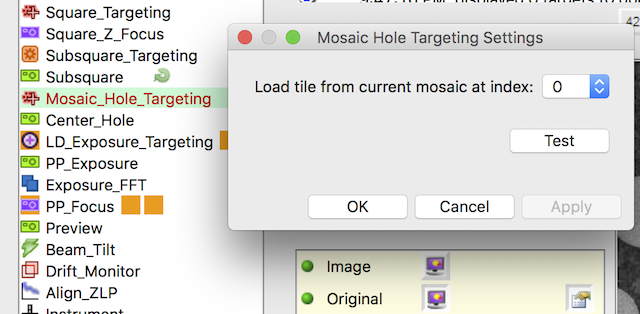

Available in, for example, Mosaic_Hole_Targeting Node in MSI-PP-Stich application

To be documented fully. But it involves setting the parameters on one of the subsquare in the stitched square in a way similar to Template Holefinder in MSI-T and then
run on all of the subsquares.

