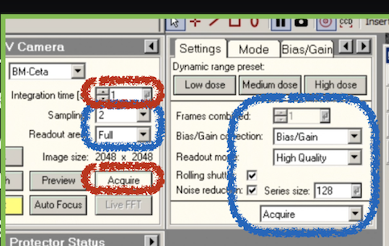
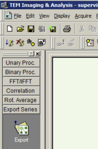

## Download AutoIt Scripting program on microscope computer

see https://www.autoitscript.com/site/autoit/downloads/

## Compile *.au3 files

These are found in your_myami/pyscope/autoit/. Right-click on the file icon should allow you to compile. Place the resulting exe files at a common place, for example, **C:\Program Files\AutoIt3** and remember its location to be added to fei.cfg

#### There are two versions Exporting Tia Series: TiaExportSeries.au3 and TiaExportSeries2.au3. The difference is the position of the mouse click in the dialogue. Please try them and find which one works for you.

## Add the locations of the exe files to fei.cfg of your leginon installation if you have not done so.

1.  make a copy of your_myami/pyscope/fei.cfg.template and call it fei_temp.cfg
2.  compare fei_temp.cfg with your current fei.cfg used for leginon and modify fei_temp.cfg according to your current configuration.
3.  find the entries related to AUTOIT and fill in the location of your autoit exe files.

## Beamstop Testing

1.  You can double click on BeamstopIn.exe and Beamstopout.exe to see if it does what it should be doing.

## TUIAcquire Testing

1.  Go to TUI interface and CCD/TV Camera panel.
2.  Select BM-Ceta
3.  Double click on TuiAcquire.exe to execute. This is most likely to fail in some of the validation steps. Make correction to these settings and try again. See the screenshot below. The items in the blue boxes are what it validate. The items in the red boxes are what it controls.
4.  When all validations are passed, you should see TIA starts acquiring movie series using Acquire preset of the CCD/TV Camera panel.
5.  Double click on TuiAcquire.exe again to stop movie series acquisition.

## TiaExportSeries Testing

1.  Select TEM Imaging & Analysis (TIA) Window that has the series movie acquired from TuiAcquire.exe test above.
2.  Make sure Export Series Shortcut is expanded like in this screenshot (tip: Set TIA Not to Embed into Microscope UI in TUI Application Preferences so the shortcut panel will show)
    1.  
3.  Double click TiaExportSeries.exe

You should see the cursor moving to the shortcut, click it and going through the export process. The script should save the series as C:\Users\supervisor\Documents\FEI\TIA\Exported Data\test_t_*.bin

AutoIt Script clicks Export Series shortcut icon at a relative position to the corner of the window. If you observe that the position is off, please edit the script at the line

       Local $aExportPos[2] = [47, 273]

You can use AutoIt Window Info (part of AutoIt program installation) to find the coordinates that needs to replace 47, 273 (col, row).
