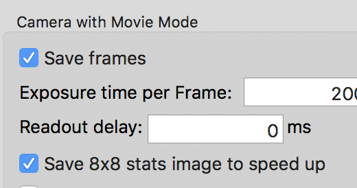

General frame-saving camera workflow in Leginon requires a 2D image array return from the camera to conclude its operation. This array is transferred through the network, dark and gain corrected, and saved to the data disk. With counted mode and good network, this represents 1-2 s of time. With super-resolution, the time required including loading of the dark/norm images can be 5 seconds or more. With the speed of camera acquisition increases, this becomes a bottleneck for speed during automated data collection.

This new feature, turned on/off from PresetsManager of the frame-saving preset, does the following:

1.  Calculate the full array stats while it is on K2/K3 camera PC
2.  Create a roughly Guassian-distributed image at 8x8 pixels that has the mean and standard deviation of the full array in the above step on K2/K3 PC
3.  This 8x8 image is transferred through the network to Leginon to conclude its operation.
4.  Leginon skips dark and gain correction on images of such array but record in the database the normalization references of dark/norm images so that the movie can be dark and gain corrected without issue.
5.  Leginon saves this 8x8 image on data disk with minimal footprint.

Because the 8x8 image retains the statistic characteristic of the full array, it can be used for ALS ice-thickness calculation and for monitoring the change of beam intensity etc.

