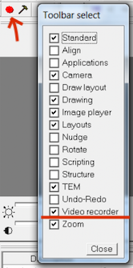
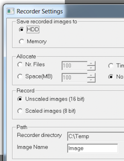
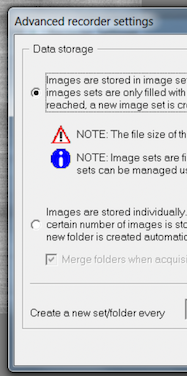

TVIPS F416 camera has rolling shutter movie collection capacity, accessible through EMMENU.

## Leginon view port configuration setup

[Create Leginon view port](/leginon/Leginon_Manual/New_User_Features_35/Tivips_f416_electron_diffraction_recording/Create_Leginon_view_port)

This setup will be used by Leginon to control view port 1. The configurations will be changed through EMMNENU scripting

## Recorder configuration

### Make sure recorder tool (red dot) is shown in toolbar

Reach toolbar view selection through EMMENU4/View/Toolbar>

### Set recorder options

Click on the hammer next to the recorder tool to set these.
If you have installed an SSD, set it to a directory on that drive which can speed up the saving.

Basic settings

Advanced settings: save in tvips image set format

## Leginon instruments.cfg

Replace

    class:tietz.TietzF416

with

    clas:tietz2.EmMenuF416

## Set up tvips.cfg

1.  Copy pyscope/tvips.cfg.template to the same directory where instruments.cfg is read on TVIPS PC and rename it as **tvips.cfg**
2.  Match the recorder directory and default filename with what is in EMMENU4 recorder settings.
