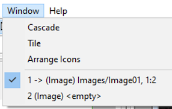
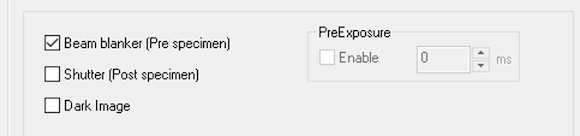

EM-Menu use saved and loaded viewports to set preset configuration. In order not to disturb its other behavior, Leginon
uses a specific named viewport when it controls the camera.

1. Open EM-Menu on TVIPS computer. The last configuration and view port used is typically appeared and activated.

2. Select viewport 1 if it is not yet selected from Window menu. The number at the window name is the viewport id. Here is an example of what you may select if there are multiple viewports opened.

3. Select from menubar Camera/Configuration Manager ...

4. Click New to create a configuration, name it Leginon

Here is an example:

-   Format
    

-   Shutter
    

-   Flatfield
    

5. Save the current configuration list as a backup.

5. close the dialog and reopen by repeating step 3. Leginon should either be selected or at least listed as an existing configuration.

## Testing

1. Close EM-Menu and then reopen. Use step 2-3 in the previous section to check if the new viewport is loaded.
