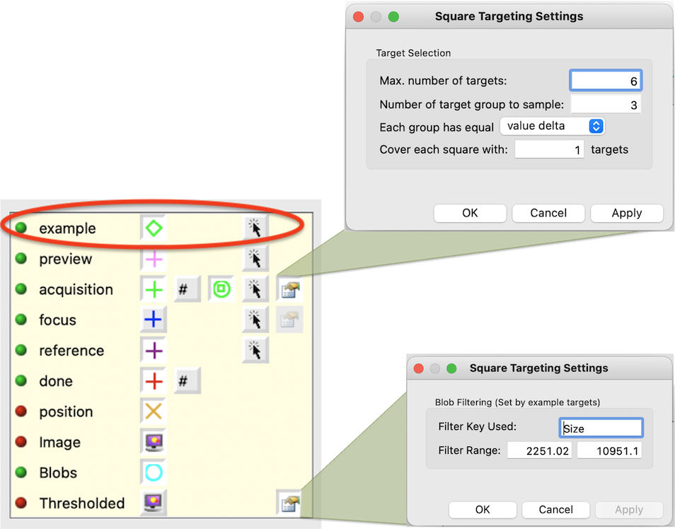
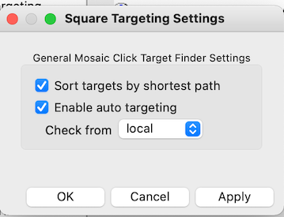
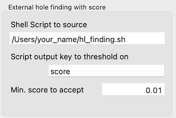
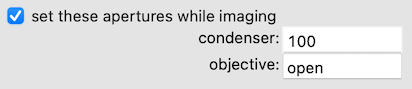

## First-time Leginon setup

Run MSi-Ptolemy and start a new session. This session can be used for setting up and as the example session that the autoscreen base its settings and stage z height on.

1.  Start the session as usual.
2.  Set z to the height that is typical for this scope's eucentric height.
3.  Acquire a grid atlas for the next step.

## Setup Square Targeting Node

### Set, in Blobs Settings, the script to run as **/path_to/sq_finder.sh**

### Set the limits of the square area range in "Thresholded" settings.

You can set it directly. However, it is easier to select a number of examples targets including the smallest and the largest grid square you will choose and then click on the auto square finding tool on the toolbar. Leginon will use the example targets to set the limits of the square area.

For screening multiple grids, it is best to select a large filter range in cover all possible values.

**Filter Key Used** can be any of the displayed blob stats. For cryo grids, this is usually "Size" since it is the best key to indicate general ice thickness. Some users use "Mean" to select stain thickness in negatively stained grids.

### Define target area size sampling in the settings next to "acquisition" target panel.

Enter

1.  Maximal number of squares to select
2.  Number of target group to sample
3.  Choose group definition

For example, total of 6 squares selected in 3 groups means the program divided out all blob squares with valid area range into 3 groups. It then choose 2 blob squares in each group with highest score given by Ptolemy as the output square targets. High score in Ptolemy result means it is more likely to be a good square.

Group definition has two choices: equal value delta and equal target count. Default is equal value delta.

-   **Equal value delta grouping** depends on the "Thresholded" settings. If we use the values in the figure below, delta = (10951.1-2251.02)/3. Th first group will have blob squares in size range of 10951.1 to 10951.1+ delta. Up to two targets will be selected in there. If there are no targets in this size range, then no targets will be output. The advantage of this is that the sampled targets will still be covering small, medium, and large size even if the size distribution is highly skewed.

-   **Equal target number grouping** sorts all blob squares by the filter-key in "Thresholded" settings, and divide them into 3 bins of equal number before sampling with highest score within each. This guarantees Max. number of targets to be reached but may end up with targets all at similar size if the size distribution is highly skewed.

### Activate auto finding in the main settings dialog.

Shortest path can be applied in ordering the resulting targets as well.

## Setup Exposure Targeting Node

### Define Hole Settings

-   the script to run as **/path_to/hl_finder.sh** or whatever path your shell script is located.
-   the json key for threshold the result. For Ptolemy, this should be "score"
-   the minimal key value to accept. For Ptolemy, the probability score range is 0-1. We tend to use a very small number to only rule out the obvious bad holes. 0.01, for example.
    

### Define Ice thickness thresholding

Like JAHC template hole finder, you can narrow the selection in Leginon with hole statistics calculation and create template for convolution. The interface is similar to JAHC hole finder.

### Define target sampling

For screening, you may not want all targets found to be acquired. Use Acquisition Target Sampling section to achieve this:

### Settings for Target Sampling

Once activated, it filters the acquisition target to a maximal of the requested sample number.

## (Optional) Specify and setup auto aperture selection for nodes that need to be specified.

If you want objective aperture to be retracted only during Grid imaging, do the following on TFS scope.

1.  create myami_log directory in the user's home directory for the logger to put files there. Typically, the user is supervisor, so it would be under c:\Users\supervisor
2.  Compile autoit script ApertureSelection.au3 See [Auoit program script compilation](/leginon/Leginon_Manual/Complete_Installation/Installation_on_the_microscope_computer/Auoit_program_script_compilation). You can test it by double click the compiled executable.
3.  On the scope PC fei.cfg under [aperture] section, specify the aperture sizes in order. See pyscope/fei.cfg.template for more details.
    In the minimum you need to set
        USE_AUTO_APERTURE = True

    
    The rest depends on your setup.

1.  set the advanced settings of Grid node to

### Testing

1.  pyscope level testing through python command line interface on the scope computer **Replace Glacios with your tem class name**
        from pyscope import fei
        g=fei.Glacios()
        g.getApertureSelections('objective')
        g.setApertureSelection('objective', 'open')
        g.setApertureSelection('objective', '100')
2.  testing with TEM controller in Leginon
    1.  Leginon/Presets Manager> sent a valid preset to scope
    2.  Leginoni> select "Scope Control" node. It has an icon looks like a black stick with a green and a red button. If your old application does not have this, please see [here](/leginon/Leginon_Manual/Node_Descriptions/TEM_Controller) for required bindings so you can add it to your application.
    3.  Leginon/Scope Control> Refresh the display with the green cycling tool. You should see a display of the apertures it currently sees.
    4.  Leginon/Scope Control> Test aperture change using the tools on the tool bar. Select the mechanism and size, and then click send to scope tool.
