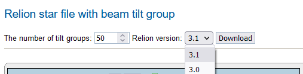

Given ctf file with beam-image tilt X and Y values, tilt-wrangler runs [k-means clustering](https://en.wikipedia.org/wiki/K-means_clustering) on X ad Y values and groups them into clusters.

Input:

-   Relion star file
-   Number of clusters for k-means

## Installation

If you used [auto-installation tool](https://emg.nysbc.org/redmine/projects/appion/wiki/Install_using_the_auto-installation_tool), you can skip installation procedure below since auto-installation does this for you. Otherwise, if you are doing manual installation follow the procedure below to install tilt-wrangler and its dependencies.
On a web server, download [tiltgroup_wrangler_cli.py](https://emg.nysbc.org/redmine/projects/appion/repository/revisions/trunk/raw/programs/tiltgroup_wrangler/tiltgroup_wrangler_cli.py), copy to /usr/local/bin and make it executable:

    wget https://emg.nysbc.org/redmine/projects/appion/repository/revisions/trunk/raw/programs/tiltgroup_wrangler/tiltgroup_wrangler_cli.py
    cp tiltgroup_wrangler_cli.py /usr/local/bin
    chmod +x /usr/local/bin/tiltgroup_wrangler_cli.py

Install numpy and scikit-learn:

    pip install numpy==1.13.3 scikit-learn==0.19.2

This particular versions are needed for this to work on CentOS 7 with Python 2.7.
For CentOS 6 use:

    pip install numpy==1.13.3 scikit-learn==0.18.2 scipy=1.2.0

## Usage

After you run CTF estimation, on processing/ctfreport.php page, scroll down to find Download button under `Relion star file with beam tilt group`.

Here you can set the number of tilt groups and choose from a drop down menu the output format (Relion version 3.1 or 3.0). Click on Download button to download Relion star file with beam-image tilt X and Y values grouped into clusters with tilt-wrangler.
