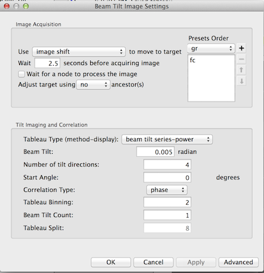
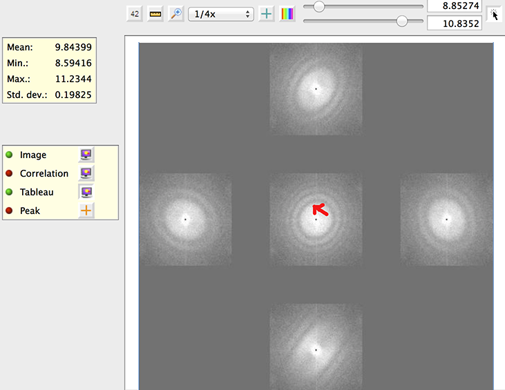

To achieve high resolution, the electron beam is best to be parallel and aligned with the optical axis of the lenses at the specimen. This is particularly important if better than 5 Angstrum resolution is required.

-   Parallel beam can be practically achieved for low dose condition in the Nanoprobe mode of FEI microscope. In Microprobe mode that is more commonly used, a smaller C2 condensor aperture will provide more parallel beam although never truly parallel. The current rotation center alignment that listed above provides a reasonable average beam tilt for given illumination area at the specimen. Since smaller C2 condensor aperture
    lets thourgh smaller percentage of the beam through, the beam intensity is lowered. Therefore, a larger spot size (smaller spot number) need to be used to give similiar illumination.

For example, at NRAMM, we improved our parallelity of the same illumination area in the final exposure by switching from 100 um C2 aperture with C1 spot 5 to 50 um C2 aperture with C1 spot 3.

-   The average beam tilt (theta) realtive to the optical axis achieved by rotation center alignment can be further refined by the so-called coma-free alignment. There are tools in Leginon that can help you do so as found in the application "MSI-T Advanced". You can also add the node in any MSI application following [Use the Application Editor to create Leginon applications](/leginon/Leginon_Manual/Create_and_Edit_Applications/Use_the_Application_Editor_to_create_Leginon_applications)

## Required bindings to Presets Manager:*

BeamTiltImagerNode - (ChangePresetEvent) -> PresetsManagerNode
PresetManagerNode - (PresetChangedEvent) -> BeamTIltImagerNode

## Settings

## Operation

If the image acquired at on-axis average beam tilt (theta=0) has minimal astigmation in its power spectrum (or diffractogram), the more the beam is tilted away from the optical axis, the stronger astigmation would be observed. The "Beam Tilt Imager" node in the application generate Diffractogram tableaus by user-defined additional beam tilt and number of tilt directions to be measured.

The objective is to adjust the average beam tilt value so that the the diffractograms of the tilts in the opposite but equal value relative to the average beam tilt look similar.

1.  Use simulated target tool  to start the tableau image acquisition
    -   The tableau is displayed in a normal Cartisian coordinate. with x+ towards right and y+ toward top.
    -   Reduce the additional tilt angle if the astigmation is too large for comparison.
2.  Move the beam tilt towards the direction of the tilted diffractogram that has a astigmation closer to the untilted diffractogram shown at the center.

In the example below, the red arrow is where we would adjust the beam tilt to. This is because because the two tilted images in the x direction look similar, suggesting no average coma beam tilt in x. The tilt image at the top has less astigmatism than the one at the bottom. The magnitude of the correction needs some experience to gauge. It is clear, though, we do not want to adjust the beam tilt to as far as the mid point in this direction.

[< Beam Tilt Calibrator](/leginon/Leginon_Manual/Node_Descriptions/Beam_Tilt_Calibrator) | [Click Target Finder >](/leginon/Leginon_Manual/Node_Descriptions/Click_Target_Finder)
