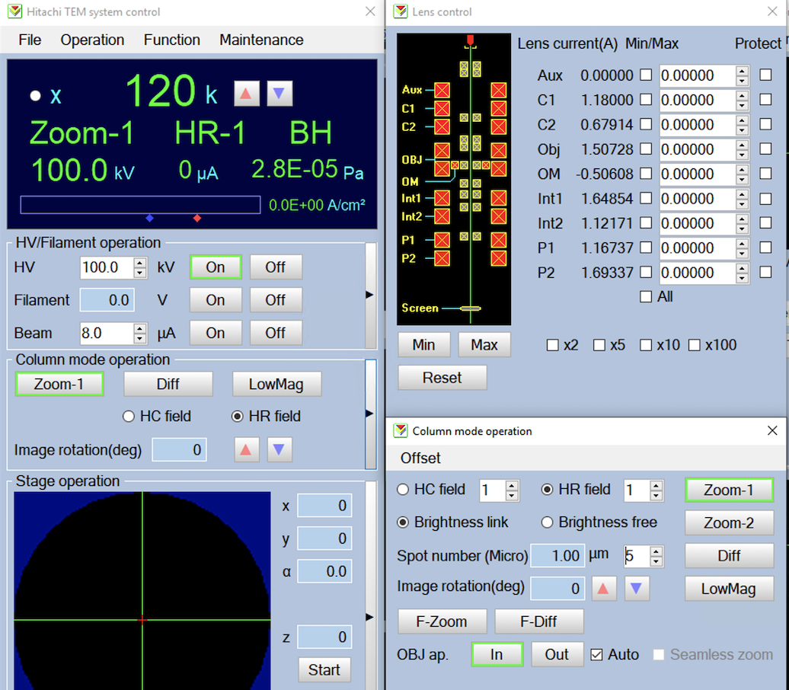

## Presets

Here is an example of presets used on our HT7800 TVIPS-XF416

LaB6 filament Operated at HT 100 kV **This is limited by the current implementation to match calibration from the manufacturer.**

Unbinned image pixel size at 120kx nominal magnification is 1.76 Å

HT7800 has a few illumination and imaging system presets. Zoom-1 imaging system presets is what we use.

We use Column mode LOWMAG, ZOOM1-HC field, and ZOOM1-HR field. The last is used for presets involved in targeting acquiring the final images.

-   Spot Size behaves the same as Spot number on Hitachi interface. However, Hitachi gui does not always change its display when we set this value at the lower level. Please check C1 and C2 lens values for the actual effect correspondance.

-   Preset Cycling should always be used.

  Magnification:   probe mode:   Preset name:   Image Shift (x,y):   Dimension:   Binning:   Beam coverage:   Exposure Time (ms):   Spot Size:   Defocus (m):
  ---------------- ------------- -------------- -------------------- ------------ ---------- ---------------- --------------------- ------------ --------------
  300              low-mag       gr             Aligned              1024         4          max              100                   1            0.0
  1500             micro-hc      sq             Aligned              1024         4          1x CCD size      100                   3            0.0
  15000            micro-hr      hl             Aligned              1024         4          1x CCD           100                   3            --5e-4
  120000           micro-hr      fc             0,0                  1024         2          ~2x CCD         400                   5            --5e-7
  120000           micro-hr      fa             0,0                  1024         4          ~4x CCD         100                   5            --2e-6
  120000           micro-hr      en             0,0                  4096         1          ~4x CCD         100                   5            --1e-6

The screenshot below shows what each Hitachi panel looks like in at en preset.

