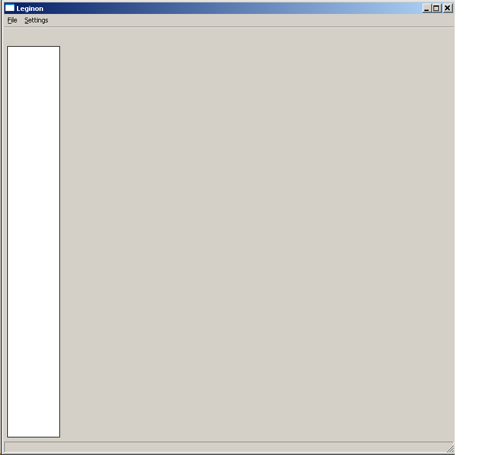

Leginon Client is run on the microscope/camera-controlling computers (and the robot controlling computer, if applicable) so that the main Leginon program on the remote computer can launch the necessary node at the right place. For example, in order for the remote computer to get and set microscope parameters, the Instrument node need to be launched on the microscope-controlling computer. Before starting Leginon Client, check that your camera controlling software is set up properly for Leginon interaction:

## Using a Gatan Camera

1.  Open Digital Micrograph (or check that the Tietz software is closed).
     
2.  insert the Gatan CCD in Digital Micrograph.

## Using a Tietz Camera

1.  Close Tietz TCL program
     
2.  Put camera switch box to select CCD.

## Using a Direct Electron DE-12/DE-20 Camera

1.  Start DirectElectronAPI.exe and MicroManager
     
2.  Set the desired **Frames Per Second** and cool down the camera to the desired temperature in MicroManager
     
3.  Close MicroManager but leave DirectElectronAPI.exe running

## Using FEI Falcon/Gatan Orius combination

1.  Start TUI
2.  Start Digital Micrograph
3.  Start TIA
4.  Set Camera selection in TUI/CCD/TV Camera to BM-Falcon

## Start Leginon Client

-   scope> Start Leginon Client (Either with the shortcut on the Desktop or follow the Start Menu-\Start\Programs\Leginon>Leginon Client)

Leginon Client GUI is fairly limited and won't do anything if the main processing host does not put any nodes on it.

-   During Leginon run an Application Error Message may pop up saying

    Exception EAccessViolation in module adaExp.exe at ....

    Access violation at address xxxx in module 'adaExp.exe'. Read of address xxxx"

Do NOT touch this message box, or leginon client will need restarting.

## If the camera is controlled separately from the scope host, Start Leginon Client there, too.

See [Using Leginon on a system where the microscope and camera are controlled by different computers](/leginon/Using_Leginon_on_a_system_where_the_microscope_and_camera_are_controlled_by_different_computers).

[< Test Network Connection Between Remote and Instrument Computers](/leginon/Leginon_Manual/Start_Leginon/Test_Network_Connection_Between_Remote_and_Instrument_Computers) | [Start Leginon at your main working station remotely >](/leginon/Leginon_Manual/Start_Leginon/Start_Leginon_at_your_main_working_station_remotely)
