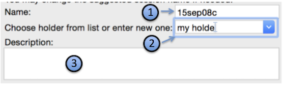
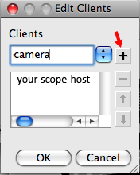

### [Set yourself up as a Leginon/Appion user if you have not done so](/leginon/Leginon_Manual/Administration_Tools/Set_up_for_a_new_regular_user)

## Start the remote Leginon Client on the microscope   [Start the remote Leginon Client on the microscope](/leginon/Run_Leginon_Client_on_the_Microscope_Computer) as described in the previous section if you have not done so. For Tietz camera, this will need to be restarted every time you establish and then remove the connection to it.

## Start the main Leginon processing program

-   start-leginon.py (From any directory for Linux)
     
-   Note: This works because start-leginon.py is installed in the default bin path and the rest of the python files in python's default site-package directory. If you have other path ahead of the default in the python path, there is a possibility that a wrong module is loaded as found in http://emg.nysbc.org/redmine/boards/6/topics/788. Reset the python path before starting will solve the problem.

## Select or Create a session

You can either create a new one, or, for later start-up, select a previous session

### Create New Session

-   Leginon Setup Wizard> select "Create session" in session type if a new session is needed.
    
    *# Default session name will autoincrement next time you or other creates one. You can pick your ownname but do not use anything non alpha-numerical.
    *# Custom holder name can be entered in the combobox. It will be saved in the database and allow you to select it.
    *# A short description of the session can include specific sample preparation. There is no need to include information already identifiable by the project.

Session name and Description will appear in Viewers for session selection. Therefore, it is recommend not to make latter too long.

-   Leginon Setup Wizard> Select the project that this new session is associated with

-   Image path is automatically selected based on your [leginon.cfg](/leginon/Leginon_Manual/Complete_Installation/Processing_Server_Installation/Configure_leginoncfg) file. This is the path under which a subdirectory will be created in the name of your session. If necessary, you can modify this base path.

OR

### Leginon Setup Wizard> Select a previous session you have created using the same instrument.

## Create new client host or select existing client host names to add to the remote client list

### Create new client host

1.  Leginon Setup Wizard> on the clieck "Edit" next to "Connect to Client" to start "Edit Client" dialog
    
2.  Edit Client Dialog> To create a new client host, type the name in the empty text box and then click on "+" **NOTE: when you edit the client the first time, "+" is not activated until you type a name in the entry box to the left of it**.
3.  Edit Client Dialog> Click "OK" to apply the client editing.

-   **Make sure that you click on "+" to add the client to the list when creating or selecting. Just have the name show up in the selection window is not enough!**
-   The name of the client host should correspond to what you found in the network testing "test1.py" and likely all in lower case according to message#1821
-   The host on which you are running the main Leginon process does not need to be included in this list.

## Check your parameters:

-   "Connect to clients" should list the client host(s) you have just edited. If it says "(no clients selected)", you need to go back to the last step and make sure you click on "+" after you make each host you want appear in the selection window.

1.  Make sure that the Leginon Client has been started on each of the host in your list before finishing the wizard. See [Using Leginon on a system where the microscope and camera are controlled by different computers](/leginon/Using_Leginon_on_a_system_where_the_microscope_and_camera_are_controlled_by_different_computers).

The host on which you are running the main Leginon process does not need to have a Leginon Client started.

## Optionally enter illumination limiting (C2) aperture size for displaying beam size at targeting nodes. Calibration required.

## Choose "Finish" in the set up wizard to start the session.

[< Run Leginon Client on the Microscope Computer](/leginon/Leginon_Manual/Start_Leginon/Run_Leginon_Client_on_the_Instrument_Computers) | [What is next .](/leginon/Leginon_Manual/Start_Leginon/Start_leginon_what_is_next_)
