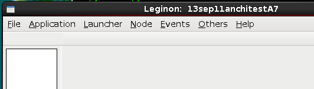
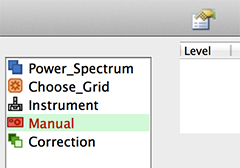
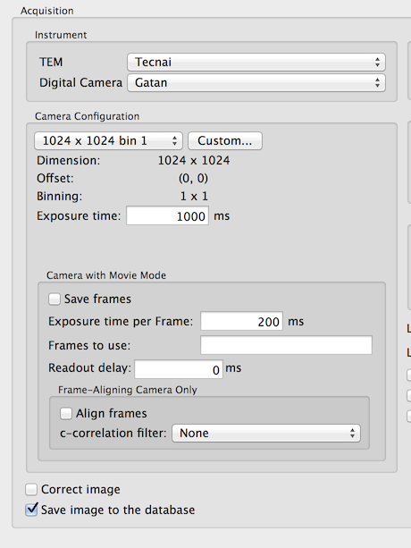

## Using a Gatan Camera

1.  Open Digital Micrograph
     
2.  insert the Gatan CCD in Digital Micrograph.

## Using a Tietz Camera

1.  Close Tietz TCL program
     
2.  Put camera switch box to select CCD.

## Using a Direct Electron DE-12 Camera

1.  Start DirectElectronAPI.exe and MicroManager
     
2.  Set the desired **Frames Per Second** and cool down the camera to the desired temperature in MicroManager
     
3.  Close MicroManager but leave DirectElectronAPI.exe running

## Make sure that you have [Leginon installed and configured](/leginon/Leginon_Manual/Complete_Installation/Installation_on_the_instrument_computers)

## Start Leginon on the Microscope computer and Import Magnifications

1.  scope> Start Leginon (Either with the shortcut on the Desktop or follow the Start Menu-\Start\Programs\Leginon>Leginon)
     
2.  Leginon Setup Wizard> select "Create session" in session type. Even though you have created a session for simulation test, it is better to create a new session so that the path mapping difference betwee Windows and Linux does not cause confusion.
     
    -   Fill in session name and comments. Comments will appear in Viewers
         
    -   Select instrument and project.
         
    -   Image path is automatically selected based on your [leginon.cfg](/leginon/Leginon_Manual/Complete_Installation/Processing_Server_Installation/Configure_leginoncfg) file.
         
3.  Choose "Finish" in the set up wizard to start the session. You should see a gui like this:
    
4.  Leginon/Main menu/Application> select "Run...." and choose the application named "Manual", both "main" and "scope" launchers will be set to the scope computer, and then launch the application.
     
5.  Leginon/Node Selector> select Instrument node.
     
6.  Leginon/Instrument> check that TEM is selected to display the parameters.
     
7.  Left-click on the tool "Get Magnification". 
     
    This will import the valid TEM magnification from the microscope into the database.
     
    **Note:** If you have installed adaExp.exe for film exposure, an Application Error Message may pop up saying
     

        Exception EAccessViolation in module adaExp.exe at ....
        Access violation at address xxxx in module 'adaExp.exe'. Read of address xxxx

    
     
    Do NOT touch this message box, or leginon client will need restarting.

## Acquiring the first real image

1.  scope> make sure you have beam and something other than a blank to image on the digital camera.
     
2.  Leginon/Application/Run> select Manual Application.
    
3.  Leginon> From the list of nodes on the left panel, select Manual node.
     
4.  Leginon/Manual> Open the "Setting" tool and then click "Advance" to access all settings to configure them if not found in Basic:
    
    -   Your TEM and Digital Camera should be available for selection.
         
    -   Acquisition/Camera Configuration- use one of the preconfigured selection for binning and size such 512x8.
         
    -   Save image to the database=yes.
         
    -   Leave the rest of the configuration to default.
         
5.  You should see your first real image acquired through Leginon in the image
    display panel.

## If you are not set up to mount the network disk on the microscope computer, the image would not be saved. Don't worry, this will happen later when you do the same on the linux host. Otherwise, check on the [Web viewer](/leginon/Leginon_Manual/Leginon_Manual_Application/Using_the_Web_viewer)

## Closing Leginon program on Windows

The best way to close Leginon program is to close the python command window (normally black) that shows up when the Leginon GUI appears since Leginon GUI window on Windows is controlled through the python command window

If you first close the GUI window, the python process is not ended. Therefore, the latter become frozen and you will have to wait for TaskManager to ask you to close the broken process.

## Problem solving for the first mircoscope test

Most common problem at this point is that your TEM or Digital Camera does not show up in Leginon for use. It is caused by lack of proper functioning or non-communicating microscope scripting or camera drivers to Leginon system's python wrapper in pyscope package. See [Installation Troubleshooting](/leginon/Leginon_Manual/Installation_Troubleshooting) and [pyScope Bulletin Board regarding testing if pyscope is working](http://emg.nysbc.org/redmine/boards/7/topics/607) for more.

If everything goes smoothly, test the network connection as in the next section and then do the same above image acquisition test through from the remote computer.

[< Test Leginon with Simulator](/leginon/Leginon_Manual/Start_Leginon/Test_Leginon_with_Simulator) | [Test Network Connection Between Remote and Microscope Computers >](/leginon/Test_Network_Connection_Between_Remote_and_Microscope_Computers)
