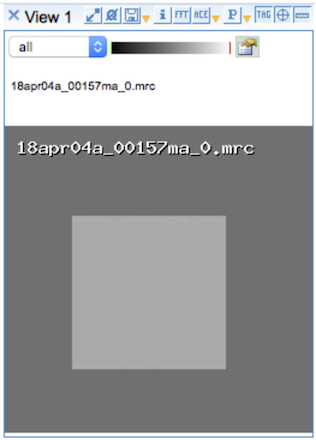

## Test Leginon with Simulator

TEM and CCD simulators are created automatically on the computer Leginon program started
at. They are convenient as a way to look around the GUI to try out buttons. The images
"acquired" are just random squares on background. Here we will use them to test the database
connection and storage disk mapping.

## Configure a local instruments.cfg to be used with the simulators

Copy pyscope/instruments.cfg.template to your home directory and rename it instruments.cfg

## Start Leginon on the computer you will run the process

1.  Register as a Leginon user and then copy and personalize your configuration file before your first use.
    -   Leginon guru: See [Recommendation for setup at a new institute](/leginon/Leginon_Manual/Administration_Tools/Recommandation_for_setup_at_a_new_institute)
    -   Regular Users: Refer to [Set up for a new regular user](/leginon/Leginon_Manual/Administration_Tools/Set_up_for_a_new_regular_user) in "Administration Tools" Chapter.
         
2.  start-leginon.py (From any directory for Linux)
     
    OR
     
    from Start Menu: \Start\Programs\Leginon> Leginon (on Windows)
     
3.  Leginon Setup Wizard> select "Create session" in session type if a new session is needed.
     
    -   Fill in session name and comments. Comments will appear in the Web Viewers
         
    -   Select instrument and project, if project database is used. Image path is automatically selected.
         
    -   Image path is automatically selected based on your leginon.cfg file.
         
4.  Leginon Setup Wizard> No need to edit client list as the computer where the program is started is automated added.
     
5.  Choose "Finish" in the set up wizard to start the session.

## Acquiring the first simulated image

1.  Leginon/Application/Run> select Manual Application.
     
2.  Leginon> From the list of nodes on the left panel, select Manual node.
     
3.  Leginon/Manual> Open the "Setting" tool and configure the settings:
     
    -   SimuTEM and SimuCCDCamera should be available for selection.
         
    -   Acquisition/Camera Configuration- use one of the preconfigured selection for binning and size such 512x8.
         
    -   Save image to the database = yes.
         
    -   Leave the rest of the configuration as default.
         
         
4.  You should see your first simulated image acquired through Leginon in the image display panel.

## Check on the Web viewer

Follow the [instruction in Manual Application Chapter](/leginon/Leginon_Manual/Leginon_Manual_Application/Using_the_Web_viewer).

It will looks like the image below. The lack of metadata is because no calibration was done. Not a problem.

## Undo the local instruments configuration

When you are satisfied, remove the instruments.cfg from your home directory as it would show up in real microscopy sessions as well.

## Problem solving for the simulation test

Most problems regarding this test are caused by bad configuration. You should double
check your [leginon.cfg](/leginon/Leginon_Manual/Complete_Installation/Processing_Server_Installation/Configure_leginoncfg), [sinedon.cfg](/leginon/Leginon_Manual/Complete_Installation/Processing_Server_Installation/Configure_sinedoncfg), [config.php](/leginon/Leginon_Manual/Complete_Installation/Web_Server_Installation) as outlined in
complete installation chapter. See [Installation
Troubleshooting](/leginon/Leginon_Manual/Installation_Troubleshooting/Test_run_operation_problems), and the [Leginon Forum](http://emg.nysbc.org/redmine/projects/leginon/boards/6) or [Web Tools Forum](http://emg.nysbc.org/redmine/projects/leginon/boards/10) such as the topic " [information not saved to db](http://emg.nysbc.org/redmine/boards/10/topics/686")
for common problems.

If everything goes smoothly, do a test directly on the computer controlling the microscope as in the next section.

[Test Leginon on the Computer Controlling the Microscope >](/leginon/Leginon_Manual/Start_Leginon/Test_Leginon_on_the_Computer_Controlling_the_Microscope)
