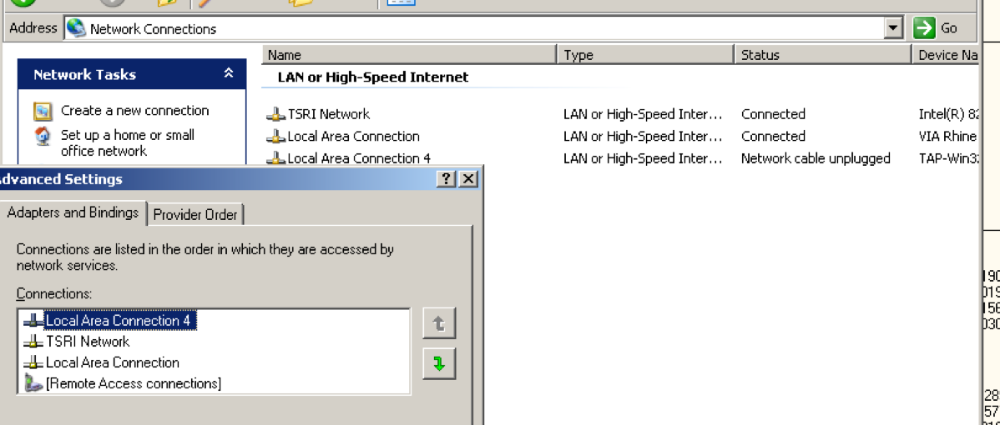

The socket server module in python that Leginon uses takes on the IP address of the first accessible network. If the network it needs to connect to other Leginon required host is not the first accessible one, the connection can not be made.

On Windows, This can be changed in Advanced Settings of Network Connection Control Panel.

In this case of a microscope PC, "Local Area Connection 4" is not used even though it is the first in the order. "TSRI Network" is the one connects to the support PC or the private network for Leginon system. Its order before "Local Area Connection" makes python socket server recognizes its IP address.
